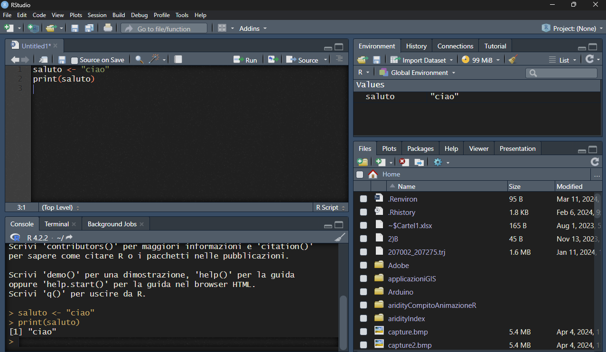

```{r setup, include=FALSE}
knitr::opts_chunk$set(echo = TRUE)
```

## Cosa impareremo

-   struttura di R (base e pacchetti), potenzialità
-   RStudio: come funziona (panoramica)
-   Documentazione, esempi, snippets per imparare
-   assegnazione ed utilizzo variabili
-   principali strutture dati: oggetti e funzioni in R
-   leggere e scrivere dati tabellari e complessi

## Introduzione

-   struttura di R - percorso di installazione
-   

## RStudio

-   versione desktop/server
-   vantaggi interfaccia:
    -   console/terminale/background

{width="10in"}

## Immissione dei comandi

R è un programma basato su righe di comando.

L'utente immette i comandi al prompt ( \> ) e ciascun comando viene
eseguito uno alla volta andando a capo.

Le righe di comando solitamente vengono salvate in un file "script" con
estensione "R" (.R) e vengono eseguite una alla volta mediante "invio" o
con selezione multipla e "invio".

Con RStudio è possibile eseguire l'intero file, fermandosi eventualmente
in punti specifici "breakpoints" (lo vedremo durante il corso)

### Esercizio:

esegui comando della figura alla [slide precedente](#).

```{r echo=TRUE}
saluto <- "ciao"
print(saluto)
```

## Documentazione, esempi, snippets per imparare

Ogni singola funzione ha ampia documentazione con molti esempi.
Chiamando una funzione dopo uno o due punti interrogativi richiama la
documentazione. Quasi sempre gli esempi sono eseguibili facendo
copia/incolla

### Esercizio:

esegui il primo esempio dalla documentazione della funzione *print*

```{r}

?print
??print

```

## Variabili e funzioni (parte 1)

Qui vediamo una variabile ed una funzione.

**NB1** - la variabile "saluto" è nel environment
("ambito/ambiente/campo") *globale\**. La funzione "print" è nel cmapo
del package "base" - tieni premuto il tasto CTRL e seleziona il nome
della funzione - vedi cosa succede.

**NB2** - operatore di assegnazione `<-` (o `<<-` nel caso si voglia
forzare l'assegnazione ad una variabile *globale\**)

{width="10in"}

## Variabili e funzioni (parte 1) - Scope

\*Le variabili create al di fuori di funzioni sono note come variabili
***globali*****;** possono essere utilizzate sia all'interno delle
funzioni che all'esterno.

Sotto andiamo a creare una nostra funzione "salutami" che esegue il
saluto. Provate a modificare l'operatore di assegnazione da `<<-` a
`<<-` e rieseguire!!

```{r}

salutami <- function(){
  saluto <- "ciao ARPA!!!"
  print(saluto)
}

print(saluto)
salutami()
print(saluto)


```

## Strutture dati in R

NB ogni elemento in R è considerato (ed è) un VETTORE. Le funzioni di R
considerano ogni variabile un vettore. Cosa significa? Che le funzioni
elaborano tutti gli elementi di un vettore "by default" e che ogni
elemento è indicabile con un numero iniziando da 1 (non da 0 come
solitamente succede in altri linguaggi).

-   vector
-   character
-   integer
-   numeric

```{r   echo=T,  eval=FALSE, comment=F }

miaVar <- FALSE
class(miaVar)
miaVar[[1]]
miaVar[[2]]

```

## Strutture dati in R - vettori

### Esercizio:

perchè succede quello che vedete sotto?

```{r  }

miaVar <- c(1,4,6,8)
class(miaVar)
miaVar[[1]]
miaVar[[2]]

miaVar[[2]] <- "evviva"
class(miaVar)
print(miaVar)

```

## Strutture dati in R - list

La struttura "vector" vettore, può contenere solo una tipologia base
(numeric, integer, character, logical). Ma la struttura LIST no!

### Esercizio:

```{r  }

miaVar <- list(1,4,6,8)
class(miaVar)
miaVar[[1]]
miaVar[[2]]

miaVar[[2]] <- "evviva"
class(miaVar)
miaVar[[1]]
miaVar[[2]]
print(miaVar)

```

## Strutture dati in R - list/nomi

NB, la struttura LIST non è altro che un set, una "lista", di oggetti
associata ad un indice. L'indice è un numero intero ma può essere un
testo (simile al concetto di coppie "key-\>value"/chiave-\>valore)

## Strutture dati in R - allocazione

Svantaggi di List: usa + memoria! NB se dovete gestire volumi importanti
di dati, considerate la pre-allocazione della memoria.

```{r}

vettoreMoltoGrande = numeric(1000)
vettoreMoltoGrande[[100]]

```

## Strutture dati in R - multidimensionali

[[***le strutture si basano sempre su vettori come elemento di
base!***]{.underline}]{.smallcaps}

Array e matrici.

## Gli operatori di R {#sec-gli-operatori-di-r}

Gli operatori binari e logici di R sembreranno molto familiari ai
programmatori. Tieni presente che gli operatori binari funzionano sia su
vettori che su matrici, oltre che su scalari.

### Gli operatori aritmetici includono:

-   \+ aggiunta - sottrazione \* moltiplicazione / divisione \^ o \*\*
    esponenziale

### Gli operatori logici includono:

-   \> più grande di \>= maggiore o uguale a == esattamente uguale a !=
    non uguale a

## 

## DOMANDE

-   Se avete una serie di valori di concentrazione di CO2 con 1 milione
    di valori come li assegnate ad una variabile? (....) indicano i
    valori.

    1.  val.co2 \<- list(.....)

    2.  val.co2 \<- c(.....)

    3.  val.co2 \<- numeric(1e6); val.co2

## RISPOSTE

-   1
