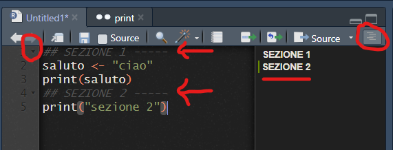

```{r setup, include=FALSE}
knitr::opts_chunk$set(echo = TRUE)
```

## Cosa impareremo

-   struttura di R (base e pacchetti), potenzialità
-   RStudio: come funziona (panoramica)
-   Documentazione, esempi, snippets per imparare
-   assegnazione ed utilizzo variabili
-   principali strutture dati: oggetti e funzioni in R
-   leggere e scrivere dati tabellari e complessi

## Introduzione

-   struttura di R - percorso di installazione


## RStudio

-   versione desktop/server
-   vantaggi interfaccia:
    -   console/terminale/background
    -   progetti/packages/help
    -   Environment/History/Connection/Tutorial
-   Salvare un progetto, cartella di progetto, GIT e GitHub
-   Working Directory predefinita, uso del tab per richiamare percorsi


## Righe codice - i comandi

R è un programma basato su righe di codice con comandi che eseguono
elaborazioni su dati.

L'utente immette i comandi al prompt ( \> ) e ciascun comando viene
eseguito uno alla volta andando a capo.

Le righe di comando solitamente vengono salvate in un file "script" con
estensione "R" (.R) e vengono eseguite una alla volta mediante "invio" o
con selezione multipla e "invio".

Con RStudio è possibile eseguire l'intero file, fermandosi eventualmente
in punti specifici "breakpoints" (lo vedremo durante il corso).

### Esercizio:

esegui comando della figura alla [slide precedente](#).

```{r echo=TRUE}
saluto <- "ciao"
print(saluto)
```

## Righe codice - commenti e sezioni

Se non si vuole eseguire delle righe, basta mettere un carattere
asterisco (`#`) all'inizio del testo che NON si vuole eseguire.

NB se inserito all'inizio della riga, e seguito da testo e da 4 o più
caratteri `-` o `#`, il testo diventa una sezione

{width="5in"}

### 

## Documentazione, esempi, snippets per imparare {#sec-documentazione-esempi-snippets-per-imparare}

Ogni singola funzione ha ampia documentazione con molti esempi.
Chiamando una funzione dopo uno o due punti interrogativi richiama la
documentazione. Quasi sempre gli esempi sono eseguibili facendo
copia/incolla

### Esercizio:

esegui il primo esempio dalla documentazione della funzione *print*

```{r eval=FALSE, echo=TRUE, include=FALSE}

?print
??print

```

## Packages/Librerie

Tantissime funzionalità aggiuntive sono disponibili su componenti
aggiuntivi che vanno installate con il comando
`install.packages(<nome libreria>)` e poi caricate con il comando
`library(<nome libreria>)`. Da RStudio possiamo caricarle da interfaccia
grafica.


## Variabili e funzioni (parte 1)

Qui vediamo una variabile ed una funzione.

**NB1** - la variabile "saluto" è nel Environment
("ambito/ambiente/campo") *globale\**. La funzione "print" è nel campo
del package "base" - tieni premuto il tasto CTRL e seleziona il nome
della funzione - vedi cosa succede.

**NB2** - operatore di assegnazione `<-` (o `<<-` nel caso si voglia
forzare l'assegnazione ad una variabile *globale\**)


## Variabili e funzioni (parte 1) - Scope

\*Le variabili create al di fuori di funzioni sono note come variabili
***globali*****;** possono essere utilizzate sia all'interno delle
funzioni che all'esterno.

Sotto andiamo a creare una nostra funzione "salutami" che esegue il
saluto. Provate a modificare l'operatore di assegnazione da `<<-` a
`<<-` e rieseguire!!

```{r}

salutami <- function(){
  saluto <- "ciao ARPA!!!"
  print(saluto)
}

print(saluto)
salutami()
print(saluto)


```

## Strutture dati in R

NB ogni elemento in R è considerato (ed è) un VETTORE. Le funzioni di R
considerano ogni variabile un vettore. Cosa significa? Che le funzioni
elaborano tutti gli elementi di un vettore "by default" e che ogni
elemento è indicabile con un numero iniziando da 1 (non da 0 come
solitamente succede in altri linguaggi).

-   vector
-   character
-   integer
-   numeric

```{r   echo=T,  eval=FALSE, comment=F }

miaVar <- FALSE
class(miaVar)
miaVar[[1]]
miaVar[[2]]

```

## Strutture dati: vettori

### Esercizio:

perchè succede quello che vedete sotto?

```{r  }

miaVar <- c(1,4,6,8)
class(miaVar)
miaVar[[1]]
miaVar[[2]]

miaVar[[2]] <- "evviva"
class(miaVar)
print(miaVar)

```

## Strutture dati: matrix

Matrix è un oggetto con struttura di matrice ovvero bidimensionale
(righe × colonne); pensate a un gruppo di vettori impilati o affiancati.

Si accede e si assegnano i valori con [r,c] dove r e ci sono gli indici
di riga e colonna. Si può lasciare vuoto un indice per accedere alla
riga/colonna

```{r}
mat <- matrix(c(1, 2, 3, 4), nrow = 2, ncol = 2)
mat[[2]]
mat[1,2]
mat[1,]
mat[1,2] <- 100


```

## Strutture dati: array

Un array è una matrice multidimensionale.

r=rows, c=columns, m=matrice.... etc...

### Esercizio:

Vedi sotto come creare un array a 3 dimensioni. Nota che duplica 9
valori 2 volte. Prova a dare 8 valori invece che nove. Prova a dare 3
valori. Cosa succede.

```{r}
 
# 2 vettori di valori 
valori1 <- c(5, 9, 3) 
valori2 <- c(10, 11, 12, 13, 14, 15) 
column.names <- c("C1", "C2", "C3") 
row.names <- c("R1", "R2", "R3") 
matrix.names <- c("Matrix1", "Matrix2") 
  
# Crea un array a tre dimensioni 
arr <- array(c(valori1, valori2), dim = c(3, 3, 2), 
                  dimnames = list(row.names, 
                                  column.names, 
                                  matrix.names)) 
print(arr) 

```

## Strutture dati: list

Le strutture vector/matrix/array, possono contenere solo una tipologia
base (numeric, integer, character, logical...). Ma la struttura LIST no!

La struttura *list* è un set di dati eterogenei; opzionalmente, è
possibile assegnare dei nomi a ciascun elemento nel set.

```{r  }

lista <- list(1,4,6,8)
class(lista)
lista[[1]]
lista[[2]]

lista[[2]] <- "evviva"
class(lista)
lista[[1]]
lista[[2]]
print(lista)

```

## Strutture dati: list/nomi

NB, la struttura LIST non è altro che un set, una "lista", di oggetti
associata ad un indice. L'indice è un numero intero ma può essere un
testo (simile al concetto di coppie "key-\>value"/chiave-\>valore).

Può essere assegnato un indice/chiave per riferimento all'elemento nella
lista

```{r}

names(lista)
names(lista) <- c("primo", "secondo")
lista[[1]]
lista[["primo"]]

```

## Strutture dati: allocazione

Svantaggi di strutture tipo *list*: usa più memoria!

NB se dovete gestire volumi importanti di dati, considerate la
pre-allocazione della memoria SE conoscete la dimensione. Vedi anche
blog
[qui](https://blog.sellorm.com/2019/12/16/vector-pre-allocation-in-r-a-simple-example/).

```{r}

vettoreMoltoGrande = numeric(1000)
vettoreMoltoGrande[[100]]

```

## Strutture dati: Data frame

Un *data frame* è una struttura di tipo *list* ma con un numero uguale
di “righe” per ogni colonna di attributi. È possibile manipolare i data
frame filtrando sulle righe e operando sulle colonne.

Sia righe che colonne possono avere identificativi.

```{r}
 c.lat <- c(45.1, 45.2, 45.3)
 c.lon <- c(11.1, 11.2, 11.3)
 
 df.geo.stz <- data.frame(stz=c("A", "B","C"),
                          longitudine=c.lon,
                          latitudine=c.lat)
 
 colnames(df.geo.stz)
 rownames(df.geo.stz)
 rownames(df.geo.stz) <- df.geo.stz$stz
 rownames(df.geo.stz)
 
```

## Strutture dati: Data frame

Le colonne sono *vettori* - si può richiamare e assegnare i valori di
una colonna con `$` o `[[]]` o `[,"<nomecolonna>"]`

```{r eval= FALSE }
df.geo.stz$stz
df.geo.stz[,"stz"]
df.geo.stz[["stz"]]
df.geo.stz$stz <- c("A1","B1", "C1")

```

## Strutture dati - Tibble

Un data frame particolare, lo vedremo quando usiamo l'infrastruttura di
librerie "tidyverse".

NB - qio

```{r eval=FALSE, message=FALSE, warning=FALSE }
library(tidyverse)
geo.stz.tb <- tibble(df.geo.stz)
class(geo.stz.tb)
geo.stz.tb
```

## Convertire oggetti

Oggetti tra loro compatibili si possono convertire; ad esempio tra
matrix =\> data.frame usando il comando
`as.data.frame(<oggetto matrix>)` viceversa attenzione che tutti i tipi
di vettore vengono resi omogenei.

Provate il seguente esercizio sotto.

```{r eval=FALSE}
mat
df.mat <- as.data.frame(mat)
as.matrix(df.mat)
df.mat$nuovaColonna <- "testo"
as.matrix(df.mat)
```

## Salvare oggetti R

Rstudio può salvare l'intero progetto con le variabili e le funzioni che
vedete in alto a destra.

Il comando `save` salva in un file con estensione "rda" che viene
riconosciuto anche direttamente da RStudio.

Prova a cliccare sul file dopo aver lanciato la prima riga del comando
seguente!

```{r}
save(df.geo.stz, miaVar, file="oggetti.rda")
load("oggetti.rda")
saveRDS(df.geo.stz, file = "geo.stz.RDS") 
df.geo.stz <- readRDS("geo.stz.RDS")
```

## Operatori di R {#sec-gli-operatori-di-r}

Gli operatori aritmetici e logici di R funzionano sia su singoli scalari
che su vettori e strutture come array e matrix.

NB questo vuol dire che si possono eseguire operazioni su tutti i
singoli valori della struttura internamente (vectorization)!

```{r}
c.lat + 10
c.lat == c.lon

c.lat[[1]] <- 44
c.lat <- c.lat - 1

```

## DOMANDE

-   Se avete una serie di valori di concentrazione di CO2 con 1 milione
    di valori come li assegnate ad una variabile? (....) indicano i
    valori.

    1.  val.co2 \<- list(.....)

    2.  val.co2 \<- c(.....)

    3.  val.co2 \<- numeric(1e6); val.co2

## RISPOSTE

-   1

# FINE SEZIONE

## Caricare/salvare dati

Dati in fogli di lavoro (**XLSX**) in file di testo strutturati
(**CSV**) o non strutturati come **JSON** - come leggerli/scriverli.

## Input dati: CSV

I file CSV sono notoriamente file di testo strutturati come tabelle e
molto utilizzati per condividere dati.

Il comando standard è `read.csv` .

NB non è ottimizzato per l'efficienza. Per dati massivi usare il comando
`fread` dalla libreria data.table `data.table::fread()`.

Facciamo un esercizio con dati ARPA! Scarichiamo dalla pagina
[QUI](https://www.arpa.veneto.it/arpavinforma/indicatori-ambientali/indicatori_ambientali/clima-e-rischi-naturali/immagini-e-file-allegati/2021/prec_mensili_2020.csv)
o direttamente da
[QUI](https://www.arpa.veneto.it/arpavinforma/indicatori-ambientali/indicatori_ambientali/clima-e-rischi-naturali/immagini-e-file-allegati/2021/prec_mensili_2020.csv/@@download/file)
i dati di precipitazione mensile - salvateli in una sottocartella "dati"
e caricateli usando sia la funzione read.csv che fread dalla libreria
data.table (se l'avete altrimenti vedete a schermo i risultati). Si
vuole notare le differenze e come si chiama una funzione SENZA caricare
una libreria, usando `::`.

```{r eval=TRUE, echo=TRUE, message=FALSE, warning=FALSE}

prec <- read.csv("dati/Prec_mensili_2020.csv")
prec2 <- data.table::fread("dati/Prec_mensili_2020.csv")
summary(prec2)
```

### Esercizio:

Importate i dati inserendo i parametri corretti di read.csv - come
noterete, la prima riga NON importa correttamente. La seconda si, ma è
una funzione della libreria data.table. Usate la documentazione in R per
capire come aggiungere argomenti alla funzione read.csv (vedi [sezione
QUI](#sec-documentazione-esempi-snippets-per-imparare)). **NB** usate il
tasto TAB per richiamare i percorsi, risparmiate tempo e fatica!

## Input dati: Fogli excel

I fogli di calcolo in formato MS Excel sono più strutturati rispetto ad
un file CSV, dato che ogni colonna ha anche lo specifico tipo di dati
(numero, testo, data ecc...).

Per leggere/scrivere questi dati è necessario usare librerie aggiuntive.

```{r eval=FALSE}
prec3 <- prec2
## nuova colonna 
prec3$norm2020 <- prec3$`2020 (mm)` / prec3$`media 1993-2019 (mm)`
writexl::write_xlsx( list("originale" =prec2, "elaborata"=prec3), path="dati/output.xlsx" )
prec4 <- readxl::read_xlsx("dati/output.xlsx")


```


