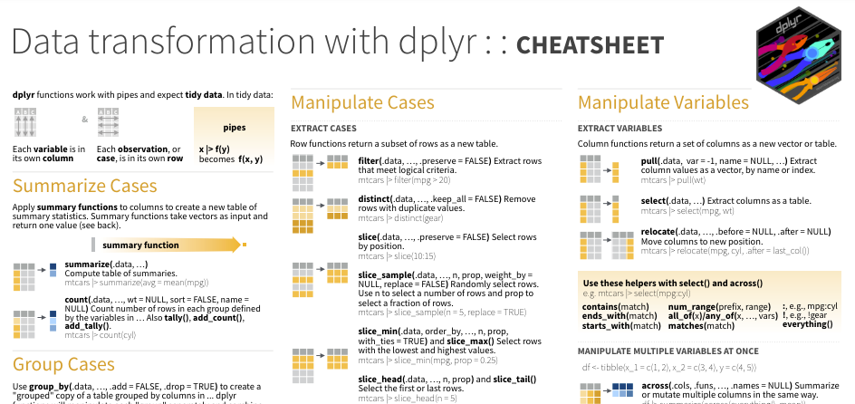
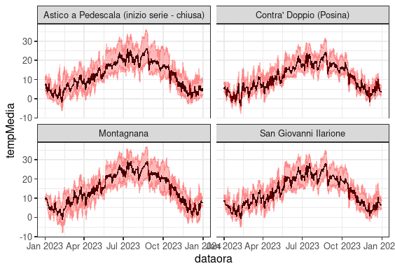
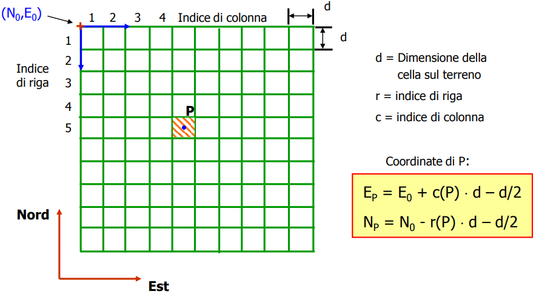

```{r setup, include=FALSE}
knitr::opts_chunk$set(echo = TRUE)
```

# Introduzione ad R {.Section1 .titlepage}

## Cosa impareremo

-   struttura di R (base e pacchetti), potenzialità
-   RStudio: come funziona (panoramica)
-   documentazione, esempi, snippets per imparare
-   principali categorie di dati: oggetti, variabili e funzioni in R
-   assegnazione ed utilizzo variabili
-   leggere, rielaborare e scrivere dati strutturati (tabelle) e non
-   leggere ed interpretare dati *geo-spaziali*
-   rappresentare dati con grafici e mappe

## Materiale

Trovate il materiale in una pagina GitHub
[QUI](https://github.com/fpirotti/ARPA2024_corsoBase/)e potrete
scaricarlo anche come zip ed anche direttamente nello spazio web
[QUI](https://www.cirgeo.unipd.it/archivio/shared/R/ARPA2024_corsoBase/).
Troviamo:

-   [slides in formato
    HTML](https://www.cirgeo.unipd.it/archivio/shared/R/ARPA2024_corsoBase/modulo1.html)

-   [contenuto slides in formato di documento A4
    PDF](https://www.cirgeo.unipd.it/archivio/shared/R/ARPA2024_corsoBase/modulo1.pdf)

-   [materiale per gli
    esercizi](https://www.cirgeo.unipd.it/archivio/shared/R/ARPA2024_corsoBase/dati)

Verrà fornito un link GDrive per caricare gli esercizi per le verifiche.

## R: panoramica

-   Ma R serve solo per analisi statistiche? No!
    -   E.g. questo materiale è creato con R (vedi *rmarkdown*)
    -   Le analisi possono diventare interattive con *Shiny* (esempi
        progetti InforSAT, VARCITIES...)
    -   ....

## R: panoramica

-   Installazione di R, versioni
-   struttura di R - percorso di installazione


## RStudio

-   versione desktop/server
-   vantaggi interfaccia:
    -   console/terminale/background
    -   progetti/packages/help
    -   Environment/History/Connection/Tutorial
-   Salvare un progetto, cartella di progetto, GIT e GitHub
-   Working Directory predefinita, uso del tab per richiamare percorsi

{width="6in"}

## Righe codice - i comandi

R è un programma basato su righe di codice con comandi che eseguono
elaborazioni su dati.

L'utente immette i comandi al prompt ( \> ) e ciascun comando viene
eseguito uno alla volta andando a capo.

Le righe di comando solitamente vengono salvate in un file "script" con
estensione "R" (.R) e vengono eseguite una alla volta mediante "invio" o
con selezione multipla e "invio".

Con RStudio è possibile eseguire l'intero file, fermandosi eventualmente
in punti specifici "breakpoints" (lo vedremo durante il corso).

> Esercizio: esegui comando della figura alla [slide precedente](#).

```{r echo=TRUE}
saluto <- "ciao"
print(saluto)
```

## Commenti e sezioni

Se non si vuole eseguire delle righe, basta mettere un carattere
asterisco (`#`) all'inizio del testo che NON si vuole eseguire.

NB se inserito all'inizio della riga, e seguito da testo e da 4 o più
caratteri `-` o `#`, il testo diventa una sezione

{width="5in"}

### 

## Documentazione/help {#sec-documentazione-esempi-snippets-per-imparare}

Ogni singola funzione ha ampia documentazione con molti esempi.
Chiamando una funzione dopo uno o due punti interrogativi richiama la
documentazione. Quasi sempre gli esempi sono eseguibili facendo
copia/incolla

> Esercizio: esegui il primo esempio dalla documentazione della funzione
> *print*

```{r eval=FALSE, echo=TRUE  }

?print
??print

```

## Packages/Librerie

Tantissime funzionalità aggiuntive sono disponibili su componenti
aggiuntivi che vanno installate con il comando
`install.packages(<nome libreria>)` e poi caricate con il comando
`library(<nome libreria>)`. Da RStudio possiamo caricarle da interfaccia
grafica.


## Packages/Librerie

Non tutti sono nella "repository" CRAN, alcuni sono su GitHub o
scaricabili da altre fonti - vedi alcune cose sotto

-   <https://github.com/fpirotti/rPET>

-   <https://github.com/fpirotti/CloudGeometry>

Per installare librarie presenti solo in CRAN si utilizza una libreria
chiamata "devtools"

```{r eval=FALSE}
# install.packages("devtools")
devtools::install_github("fpirotti/CloudGeometry")
```

## Variabili e funzioni

Qui vediamo una variabile ed una funzione.

**NB1** - la variabile "saluto" è nel Environment
("ambito/ambiente/campo") *globale\**. La funzione "print" è nel campo
del package "base" - tieni premuto il tasto CTRL e seleziona il nome
della funzione - vedi cosa succede.

**NB2** - operatore di assegnazione `<-` (o `<<-` nel caso si voglia
forzare l'assegnazione ad una variabile *globale\**)


## Variabili e funzioni: Scope

\*Le variabili create al di fuori di funzioni sono note come variabili
***globali*****;** possono essere utilizzate sia all'interno delle
funzioni che all'esterno.

Sotto andiamo a creare una nostra funzione "salutami" che esegue il
saluto. Provate a modificare l'operatore di assegnazione da `<<-` a
`<<-` e rieseguire!!

```{r}

salutami <- function(){
  saluto <- "ciao ARPA!!!"
  print(saluto)
}

print(saluto)
salutami()
print(saluto)


```

## Strutture dati in R

NB ogni elemento in R è considerato (ed è) un VETTORE. Le funzioni di R
considerano ogni variabile un vettore. Cosa significa? Che le funzioni
elaborano tutti gli elementi di un vettore "by default" e che ogni
elemento è indicabile con un numero iniziando da 1 (non da 0 come
solitamente succede in altri linguaggi).

-   vector
-   character
-   integer
-   numeric

```{r   echo=T,  eval=FALSE, comment=F }

miaVar <- FALSE
class(miaVar)
miaVar[[1]]
miaVar[[2]]

```

## Tipo dati: vettori

Perchè succede quello che vedete sotto (dati *numeric* diventano
*character*)?

```{r  }

miaVar <- c(1,4,6,8)
class(miaVar)
miaVar[[1]]
miaVar[[2]]

miaVar[[2]] <- "evviva"
class(miaVar)
print(miaVar)

```

## Tipo dati: matrix

Matrix è un oggetto con struttura di matrice ovvero bidimensionale
(righe × colonne); pensate a un gruppo di vettori impilati o affiancati.

Si accede e si assegnano i valori con [r,c] dove r e ci sono gli indici
di riga e colonna. Si può lasciare vuoto un indice per accedere alla
riga/colonna

```{r}
mat <- matrix(c(1, 2, 3, 4), nrow = 2, ncol = 2)
mat[[2]]
mat[1,2]
mat[1,]
mat[1,2] <- 100


```

## Tipo dati: array

Un array è una matrice multidimensionale.

r=rows, c=columns, m=matrice.... etc...

> Esercizio: vedi sotto come creare un array a 3 dimensioni. Nota che
> duplica 9 valori 2 volte. Prova a dare 8 valori invece che nove. Prova
> a dare 3 valori. Cosa succede.

```{r}
 
# 2 vettori di valori 
valori1 <- c(5, 9, 3) 
valori2 <- c(10, 11, 12, 13, 14, 15) 
column.names <- c("C1", "C2", "C3") 
row.names <- c("R1", "R2", "R3") 
matrix.names <- c("Matrix1", "Matrix2") 
  
# Crea un array a tre dimensioni 
arr <- array(c(valori1, valori2), dim = c(3, 3, 2), 
                  dimnames = list(row.names, 
                                  column.names, 
                                  matrix.names)) 
print(arr) 

```

## Tipo dati: List

Le strutture vector/matrix/array, possono contenere solo una tipologia
base (numeric, integer, character, logical...). Ma la struttura LIST no!

La struttura *list* è un set di dati eterogenei; opzionalmente, è
possibile assegnare dei nomi a ciascun elemento nel set.

```{r  }

lista <- list(1,4,6,8)
class(lista)
lista[[1]]
lista[[2]]

lista[[2]] <- "evviva"
class(lista)
lista[[1]]
lista[[2]]
print(lista)

```

## Tipo dati: List c/nomi

NB, la struttura LIST non è altro che un set, una "lista", di oggetti
associata ad un indice. L'indice è un numero intero ma può essere un
testo (simile al concetto di coppie "key-\>value"/chiave-\>valore).

Può essere assegnato un indice/chiave per riferimento all'elemento nella
lista

```{r}

names(lista)
names(lista) <- c("primo", "secondo")
lista[[1]]
lista[["primo"]]

```

Svantaggi di strutture tipo *list*: usa più memoria!

> **Nota su allocazione memoria**: se dovete gestire volumi importanti
> di dati, considerate la pre-allocazione della memoria SE conoscete la
> dimensione. Vedi anche blog
> [qui](https://blog.sellorm.com/2019/12/16/vector-pre-allocation-in-r-a-simple-example/).

```{r}

vettoreMoltoGrande = numeric(1000)
vettoreMoltoGrande[[100]]

```

## Tipo dati: Data frame

Un *data frame* è una struttura di tipo *list* ma con un numero uguale
di “righe” per ogni colonna di attributi. È possibile manipolare i data
frame filtrando sulle righe e operando sulle colonne.

Sia righe che colonne possono avere identificativi.

```{r}
 c.lat <- c(45.1, 45.2, 45.3)
 c.lon <- c(11.1, 11.2, 11.3)
 
 df.geo.stz <- data.frame(stz=c("A", "B","C"),
                          longitudine=c.lon,
                          latitudine=c.lat)
 
 colnames(df.geo.stz)
 rownames(df.geo.stz)
 rownames(df.geo.stz) <- df.geo.stz$stz
 rownames(df.geo.stz)
 
```

## Tipo dati: Data frame

Le colonne sono *vettori* - si può richiamare e assegnare i valori di
una colonna con `$` o `[[]]` o `[,"<nomecolonna>"]` o
`[ riga,"<nomecolonna>"]`

Come con [Tipo dati: matrix] si possono usare gli indici di
riga/colonna.

```{r eval= FALSE }
df.geo.stz$stz
df.geo.stz[,"stz"]
df.geo.stz[["stz"]]
df.geo.stz$stz <- c("A1","B1", "C1")

```

## Tipo dati: Tibble

Un data frame particolare, lo vedremo quando usiamo l'infrastruttura di
librerie "tidyverse". Vantaggi:

-   Non modifica il nome mettendo un punto al posto degli spazi (Vedi
    esempio)

-   Non utilizza mai `row.names()`. Lo scopo di *tidyverse* è quello di
    memorizzare le variabili in modo coerente. Quindi non memorizza mai
    una variabile come attributo speciale (i.e. nomi riga).

```{r message="FALSE", warning="FALSE"}
library(tidyverse)
geo.stz.tb <- tibble(df.geo.stz)
class(geo.stz.tb)
#geo.stz.tb
names(data.frame(`nome colonna con spazi` = 1)) 
names(tibble(`nome colonna con spazi` = 1))
```

-   Ricicla solo vettori di lunghezza 1. Questo perché il riciclo di
    vettori di lunghezza superiore è una fonte frequente di problemi
    nascosti. Riciclo: prova i seguenti comandi:

```{r}
v <- 1:10
v[]
v[] <- 1
v[]
v[] <- 1:5
v[]
# sotto non funziona!
#v[] <- 1:3

```

## Convertire oggetti

Oggetti tra loro compatibili si possono convertire; ad esempio tra
matrix =\> data.frame usando il comando
`as.data.frame(<oggetto matrix>)` viceversa attenzione che tutti i tipi
di vettore vengono resi omogenei.

Provate il seguente esercizio sotto.

```{r message=FALSE, warning=FALSE}
mat
df.mat <- as.data.frame(mat)
as.matrix(df.mat)
df.mat$nuovaColonna <- "testo"
as.matrix(df.mat)
df.mat
```

## Salvare oggetti R

Rstudio può salvare l'intero progetto con le variabili e le funzioni che
vedete in alto a destra.

Il comando `save` salva in un file con estensione "rda" che viene
riconosciuto anche direttamente da RStudio. NB è possibile salvare
qualiasi oggetto, anche funzioni!

Prova a cliccare sul file dopo aver lanciato la prima riga del comando
seguente!

```{r}
## NB salvo anche la funzione "salutami" fatta all'inizio!
save(df.geo.stz, salutami, file="oggetti.rda")
load("oggetti.rda")
saveRDS(df.geo.stz, file = "geo.stz.RDS") 
df.geo.stz <- readRDS("geo.stz.RDS")
```

## Operatori di R {#sec-gli-operatori-di-r}

Gli operatori aritmetici e logici di R funzionano sia su singoli scalari
che su vettori e strutture come *array* e *matrix*.

NB questo vuol dire che si possono eseguire operazioni su tutti i
singoli valori della struttura internamente (*vectorization*)!

```{r results='hide'}
c.lat + 10
c.lat == c.lon

c.lat[[1]] <- 44
c.lat <- c.lat - 1
## AND / OR
c.lat == c.lon & c.lat==0
c.lat == c.lon | c.lat==45.1
df.mat$V3 <- df.mat$V2**2
#c.lat == c.lon && c.lat==c.lat
#c.lat == c.lon || c.lat==c.lat 
```

## Esercizio 1

-   Creare una funzione chiamata *crea.df* che esegue la seguente
    operazione:
    -   creazione di un oggetto data.frame con 2 colonne, (Stazione,
        ValoreX) e 4 righe. Inventate voi i valori. Calcolo una terza
        colonna con il quadrato di ValoreX.
-   Eseguire la funzione per creare un oggetto di tipo "tibble" chiamato
    *tabella.tb*
-   **Consegnate** un file RDA contenente i due oggetti, la funzione
    *crea.df* e il tibble *tabella.tb -* chiamate il file con:
    es1_cognome_nome.rda, e.g. *es1_pirotti_francesco.rda*

# Data in/process/out {.Section1 .titlepage}

## Cosa faremo

Impareremo a leggere/trasformare/scrivere dati da fonti diverse:

-   file di testo strutturati (**CSV**)

-   fogli di lavoro (**XLSX**)

-   dati online non strutturati come **JSON**

## Input dati: CSV

I file CSV sono notoriamente file di testo strutturati come tabelle e
molto utilizzati per condividere dati.

Il comando standard è `read.csv` .

NB non è ottimizzato per l'efficienza. Per dati massivi usare il comando
`fread` dalla libreria data.table `data.table::fread()`.

Facciamo un esercizio con dati ARPA! Scarichiamo dalla pagina
[QUI](https://www.arpa.veneto.it/arpavinforma/indicatori-ambientali/indicatori_ambientali/clima-e-rischi-naturali/immagini-e-file-allegati/2021/prec_mensili_2020.csv)
o direttamente da
[QUI](https://www.arpa.veneto.it/arpavinforma/indicatori-ambientali/indicatori_ambientali/clima-e-rischi-naturali/immagini-e-file-allegati/2021/prec_mensili_2020.csv/@@download/file)
i dati di precipitazione mensile - salvateli in una sottocartella "dati"
e caricateli usando sia la funzione read.csv che fread dalla libreria
data.table (se l'avete altrimenti vedete a schermo i risultati). Si
vuole notare le differenze e come si chiama una funzione SENZA caricare
una libreria, usando `::`.

```{r eval=TRUE, echo=TRUE, message=FALSE, warning=FALSE}

prec <- read.csv("dati/Prec_mensili_2020.csv")
prec2 <- data.table::fread("dati/Prec_mensili_2020.csv")
summary(prec2)
```

> Esercizio: Importate i dati inserendo i parametri corretti di
> read.csv - come noterete, la prima riga NON importa correttamente. La
> seconda si, ma è una funzione della libreria data.table. Usate la
> documentazione in R per capire come aggiungere argomenti alla funzione
> read.csv (vedi [sezione
> QUI](#sec-documentazione-esempi-snippets-per-imparare)). **NB** usate
> il tasto TAB per richiamare i percorsi, risparmiate tempo e fatica!

## Input dati: Fogli excel

I fogli di calcolo in formato MS Excel sono più strutturati rispetto ad
un file CSV, dato che ogni colonna ha anche lo specifico tipo di dati
(numero, testo, data ecc...).

Per leggere/scrivere questi dati è necessario usare librerie aggiuntive.

```{r }
prec3 <- prec2
## nuova colonna 
prec3$norm2020 <- prec3$`2020 (mm)` / prec3$`media 1993-2019 (mm)`
writexl::write_xlsx( list("originale" =prec2, "elaborata"=prec3), path="dati/output.xlsx" )
prec4 <- readxl::read_xlsx("dati/output.xlsx")


```


## Grafici di base

La funzione `plot` riesce a creare grafici di base. Andiamo a
confrontare le precipitazioni del 2020 con quelle medie 1993-2019.

```{r fig.height=6, fig.width=6}
plot(prec3$`2020 (mm)`[1:12], prec3$`media 1993-2019 (mm)`[1:12], xlab="Prec. 2020 (mm)")
abline(1,1)
```

## Grafici di base

Miglioriamo un po' il grafico - ma utilizzeremo poi la libreria ggplot2
per ottenere grafici migliori.

```{r fig.height=6, fig.width=6}
plot(prec3$`2020 (mm)`[1:12], prec3$`media 1993-2019 (mm)`[1:12], 
     xlab="Prec. 2020 (mm)", ylab="Prec.media  (mm)",
     xlim=c(0,300), ylim=c(0,300))
abline(1,1)
```

## Input dati: JSON

I dati JSON (**J**ava**S**cript **O**bject **N**otation) sono molto
utilizzati per trasferire dati non strutturati. Vedi
[QUI](https://developer.mozilla.org/en-US/docs/Learn/JavaScript/Objects/JSON)
e
[QUI](https://www.freecodecamp.org/news/what-is-json-a-json-file-example/).
Anche per dati "geo" con il GeoJSON (vedi esempio
[QUI](https://it.wikipedia.org/wiki/GeoJSON)).

Usiamo direttamente da API ARPAV "Anagrafica stazioni in formato JSON"
dalla [pagina
QUI](https://www.arpa.veneto.it/dati-ambientali/dati-in-diretta/meteo-idro-nivo/variabili_meteo)

```{r}
## Scarichiamo direttamente da API ARPAV
api.url <- "https://api.arpa.veneto.it/REST/v1/meteo_meteogrammi?rete=MGRAMMI&coordcd=18&orario=0&rnd=0.9966091913301682"
stazioni.meteo <- jsonlite::read_json(api.url)
```

# Trasformazione dei dati {.Section1 .titlepage}

## Introduzione

Modificare dati significa aggiungere, togliere, filtrare, manipolare
colonne, creare sommari e statistiche di interesse aggregando dati.
Insomma il dato viene "manipolato". In inglese viene anche usato "data
wrangling"

Ci "alleniamo" con i dati JSON delle stazioni meteo ARPAV scaricati dal
JSON.

::: obiettivo
**Obiettivo**: creare un grafico con la posizione delle stazioni e
aggiungere qualche valore mediante unione con altri dati.
:::

## Iteratori

Fondamentale saper utilizzare operazioni che eseguono su tutti gli
elementi di un oggetto. E.g. tutte le colonne di un *data.frame*, tutte
le righe di un *data.frame*, tutti gli oggetti di una *list*...

```{r results='hide'}
dati <- stazioni.meteo$data
length(dati)
## LOOP classico: visto male per 
## performance bassa, 
## ma non necessariamente vero
for(i in 1:length(dati)){
  print(dati[[i]])
  break / next
}

funz <- function(x){
  length(x)
}
# lapply/mapply/sapply/apply per righe/colonne
# lapply(dati, funz)


```

# Tidyverse

## Introduzione 

Tidyverse, dal [sito](https://www.tidyverse.org/): "un set di funzioni e
librerie di R per la *data science*. Tutti i pacchetti condividono una
filosofia di progettazione, una grammatica e strutture di dati".

La grammatica per la manipolazione dei dati fornisce un insieme coerente
di funzioni (verbi) dalla libreria
[*dplyr*](https://dplyr.tidyverse.org/):

-   **`mutate()`** aggiunge nuove variabili che sono funzioni di
    variabili esistenti

-   **`select()`** seleziona le variabili in base al loro nome.

-   **`filter()`** seleziona i casi in base ai loro valori.

-   **`summarise()`** riduce più valori a un singolo riassunto.

-   **`arrange()`** cambia l'ordine delle righe.

Combinando con **`group_by()`** questa operazione viene stratificata
"per gruppo" aggregando le operazioni. Ci sono molti altri operatori ma
questi sono quelli di base.

## Iteratori: map 

L'operatore "map" è simile agli "apply" ma con più funzionalità. Vedi
sotto, usando *map_df* i risultati vengono raccolti su una tabella
(tibble)!

```{r   message=FALSE, warning=FALSE,  results='hide'}
library(tidyverse)
## i dati sono strutturati nell'oggetto "data" 
##  come liste dentro altre liste
# as.data.frame(stazioni.meteo$data)
dt <- map(.x = stazioni.meteo$data, .f = function(x){ x } ) 
dtf <- map_df (.x = stazioni.meteo$data, .f = function(x){ x } ) 

```

## Iteratori: map 

Mappando a data.frame con `map` abbiamo solo colonne di tipo
character... come mai?\* NB con `map_df` questo non succede perchè la
funzione `map_df` è "smart" e capisce qualche tipo usare per ogni
colonna. TRANNE che per la colonna valore. Perché?\*\*

NB gli iteratori su tabelle (data.frame o tibble) lavorano per colonne
(column-wise).

```{r results='hide'}

## richiamo la classe di ogni colonna
# map(.x = dt, .f = function(x){ class(x) } ) 
map(.x = dtf, .f = function(x){ class(x) } ) 
## ATTENZIONE - colonna valore è corretta?
dtf$valore <- as.numeric(dtf$valore)
dtf$tipo <- as.factor(dtf$tipo)
levels(dtf$tipo)
```

\*Perchè raccoglie ogni elemento della lista in un vettore ed il vettore
può avere solo valori di un tipo base (*character, numeric, integer,
logical...*) - sceglie sempre il *character* se valori misti

\*\* Nota che nel JSON il numero in "valore" è tra virgolette, dunque
viene visto come testo (character) e non come numerico. Confronta con
latitudine e longitudine!

## Filter e select

Operazioni usando tidyverse (e altri sistemi) usano operatori di
concatenzione di processi. In questo caso si usa `%>%` ovvero un
operatore che indica di usare l'output di un processo come input al
processo successivo. Un esempio con un'operazione di filtro con
successiva selezione di colonne:

```{r eval=FALSE}
## Selezioniamo solo le stazioni in provincia di Belluno
dtf.belluno <- dtf %>% filter( provincia =="BELLUNO")
## Se aggiungiamo criteri di filtro divisi da virgola è come usare AND 
dtf %>% filter( provincia !="BELLUNO", valore < 10)
dtf %>% filter( provincia !="BELLUNO" & valore < 10)
## Se aggiungiamo criteri di filtro è come usare AND
dtf %>% filter( provincia =="BELLUNO" | valore < 12) %>% select(nome_stazione, valore)
```

## Mutate

Il comando mutate consente di calcolare nuove colonne in funzione di
quelle esistenti.

```{r eval=FALSE}
dtf %>% mutate(valore=valore^2)  %>% select(valore)
```

## Aggregazioni

Operazioni di aggregazione con `group_by` e `summarise`

Attenzione - la funzione `mean` restituisce `NA` se tra i valori trova
degli `NA`, per evitare questo comportamento mettere "`na.rm = TRUE`".

```{r}
dtf %>% group_by(tipo)  %>% summarise(valore=mean(valore))
dtf %>% group_by(tipo)  %>% summarise(valore=mean(valore, na.rm = TRUE))
```

## Unione tabelle (join)

I join sono operazioni note in ambito di gestione dei dati, servono per
aggiungere in senso orizzontale valori usando una o più colonne con
valori corrispondenti.


## Unione tabelle (join)

Vediamo un esempio pratico: andiamo ad unire i valori di oggi a quelli
di alcuni giorni fa alle nostre stazioni. [Scarica qui il dato
CSV](https://www.cirgeo.unipd.it/archivio/shared/R/ARPA2024_corsoBase/dati/ARPA_temperatura_20240528.csv).

```{r}
dt.past <- read.csv("dati/ARPA_temperatura_20240528.csv")
dt.past <- dt.past %>% select(statnm, statcd, dataora, media)
dt.joined <- dt.past %>%  left_join(dtf, by=c("statcd"="codice_stazione") ) 
```

## Esercizio 2

-   Esportare un foglio excel ed un file CSV separato da TAB con i dati
    di precipitazione in Veneto fatti fino a questo punto (df.joined) ed
    un file di R che li legge in 2 oggetti tibble.

-   consegnate: i seguenti file:

    -   *es2_cognome_nome.xlsx*

    -   *es2_cognome_nome.csv*

    -   *es2_cognome_nome.R*

## Ristrutturazione: wide=\>long

Questo tipo di modifica è molto comune per rappresentare i dati in modo
differente. Vediamo un esempio pratico:

```{r}
## andiamo a creare classi di temperatura
classi <- cut(dtf$valore, breaks = c(-10,0,10,20,30))
## mappatura con tabella a doppia entrata
tb.wide <- table(dtf$provincia, classi)
## nota che è un oggetto "table", trasformiomo in data.frame
tb.wide <- as.data.frame.matrix(tb.wide)
rownames(tb.wide)
## nota ancora che le provincie sono rownames - se converto 
## a tibble non ci sono pià 
rownames(as_tibble(tb.wide) )
## creo colonna e relacate la mette all'inizio (provate senza "relocate")
tb.wide <- tb.wide %>% mutate(Provincie = rownames(tb.wide))%>%  relocate(Provincie)
## tabella con numero di stazioni per classe espressa "wide" 
tb.wide

## trasformo 
tb.long <- tb.wide  %>% pivot_longer(!Provincie, 
    names_to = "Classe Temp. °C", values_to = "Numero"
    )
tb.long

```

## Ristrutturazione: long=\>wide

Operazione inversa per tornare alla tabella di origine

```{r}

tb.long2wide <- tb.long  %>% pivot_wider( 
  names_from = "Classe Temp. °C", values_from = "Numero"
  )
tb.long2wide
```

# Grafici

## Grafici con GGplot - dispersione

Le funzioni di base "`plot`" sono utili ma ci sono librerie che
forniscono più funzionalità. Introduciamo "ggplot". Notate che viene
creato un grafico concatenando con l'operatore "`+`" gli oggetti del
grafico. "`aes`" sta per *aestethics* e indica colori e valori degli
assi, aggregazioni ecc...

```{r fig.height=4, fig.width=8, message=FALSE, warning=FALSE}
library(ggplot2)
ggplot(dtf, aes(x=quota, y=as.numeric(valore))) + geom_point( ) + 
  geom_smooth(method = "lm")+ theme_bw()
```

## Grafici con GGplot - scatola e baffi

NB. la parte "as.numeric" in quanto la colonna anche contiene numeri è
di tipo "character". Modifichiamola con "as.numeric", ma vedrete due
valori mancanti (NA=not available).

```{r warning=FALSE}
dtf$valore <- as.numeric(dtf$valore)
ggplot(dtf) + geom_boxplot(aes(x=tipo, y=valore )) + theme_bw()
```

## Grafici multipli  (facets) 

`facet_wrap` e `facet_grid` consentono di "esplodere" per una o più
variabili di raggruppamento. Qui un esempio con una stima della funzione
di distribuzione delle frequenze.

```{r   warning=FALSE}
ggplot(dtf) + geom_density(aes(x=valore )) + theme_bw()
ggplot(dtf) + geom_density(aes(x=valore)) + facet_wrap(vars(tipo)) + theme_bw() 
```

## Grafici multipli  (facets) 

`facet_wrap` e `facet_grid` consentono di "esplodere" per una o più
variabili di raggruppamento.

```{r fig.height=16, fig.width=6, warning=FALSE}
 ggplot(dtf) + geom_density(aes(x=valore)) + facet_grid(provincia~tipo ) + theme_bw()
```

## Grafici e dati geo

Abbiamo colonne con coordinate: possiamo creare un grafico con uno
sfondo territoriale e considerare delle colonne come coordinate? Per
dati geo usiamo libreria *sf* e *terra*. Non indispensabili per
geostatistica, ma fortemente consigliati.

```{r fig.height=5, fig.width=6, message=FALSE, warning=FALSE}
library(ggspatial, quietly = T)
library(sf)  ## se non l'avete installata non vi preoccupate 
theme_set(theme_bw())
ggplot(dtf) + geom_point(aes(x=longitudine, y=latitudine, color=valore, size=valore )) 
dtf.geo <- sf::st_as_sf(dtf,coords = c("longitudine","latitudine"), crs=4326 )
ggplot(dtf.geo) + geom_sf(aes(color=valore, size=valore )) + coord_sf()
```

## Grafici e stampe PNG

Il metodo per avere grafici su stampa mediante immagini o pdf

```{r eval=FALSE, message=FALSE, warning=FALSE}
png("fileGrafico.png")

 p <- ggplot(dtf.geo) + geom_sf(aes(color=valore, size=valore )) + coord_sf()
 print(p)
dev.off()
```

possiamo impostare dimensioni in pixel (width e height) ed inoltre la
risoluzione (res)... provate a vedere.

```{r  eval=FALSE, message=FALSE, warning=FALSE}
png("fileGrafico300dpi.png", width=2000, height=2000, res=300)   
  p <- ggplot(dtf.geo) + geom_sf(aes(color=valore, size=valore )) + coord_sf()  
  print(p) 
dev.off()
```

##  Grafici e stampe PDF

Il formato PDF ha il vantaggio/svantaggio di essere vettoriale (non
perde definizione) - provate a vedere la definizione. Perchè non usiamo
SEMPRE pdf? Immaginatevi a inserire milioni di punti... perde efficacia.

```{r eval=FALSE, message=FALSE, warning=FALSE}
pdf("fileGrafico.pdf")  
p <- ggplot(dtf.geo) + geom_sf(aes(color=valore, size=valore )) + coord_sf()  
print(p) 
dev.off()
```

## Cheatsheets

[Sono PDF formato poster con indicazioni di base sull'utilizzo di
strumenti R](https://github.com/rstudio/cheatsheets/)



## Esercizio 3

Vedi i due file nella cartella "esercizi/modulo1" - eseguirete il
seguente grafico estraendo i dati dalle API meteo ARPAV.



# Dati geospaziali {.Section1 .titlepage}

## Introduzione

A grandi linee i dati spaziali sono interpretati digitalmente mediante
due modelli: il modello vettoriale ed il modello raster. In entrambi i
casi va comunque compreso che ogni elemento è georiferito, ovvero ha una
localizzazione in un sistema di riferimento, quindi delle coordinate.

## Dati vettoriali

I dati vettoriali hanno tre primitive geometriche di base: punti linee e
poligoni. La base è sempre il punto con una coordinate, in 2d o 3d.

Ci sono decine di formati di file che rappresentano dati vettoriali. Ne
abbiamo visto uno all'inizio, il file JSON! Per un riferimento vedete la
[pagina QUI](https://gdal.org/drivers/vector/index.html). Ad oggi la
libreria di riferimento per leggere questi dati è la [libreria
sf](https://r-spatial.github.io/sf/).

## Raster

Il formato raster è molto semplice: sono nodi a passo costante, quindi
una "griglia" georiferita mediante uno o più punti. Il passo della
griglia è spesso identico nelle due direzioni (ma non necessariamente),
e ne determina la risoluzione spaziale.

Ci sono decine di formati di file che rappresentano dati raster. Per un
riferimento vedete la [pagina
QUI](https://gdal.org/drivers/raster/index.html). Ad oggi la libreria di
riferimento per leggere questi dati è la [libreria
terra](https://rspatial.github.io/terra/).



## Per la seconda parte:

Andremo ad imparare come usare i dati vettoriali e raster per applicare
interpolazioni con kriging.

<https://clima.arpa.veneto.it/?variable=TAS&forecast_model=ens5&scenario=Rcp85&data_series=no&year_period=djf&time_window=tw1&value_type=anomaly&city=&lat=&lng=>
