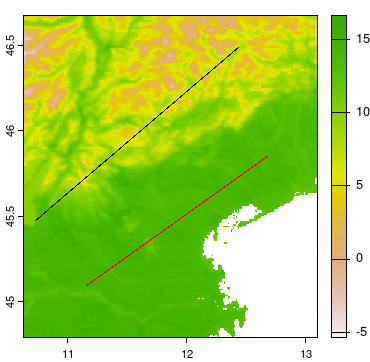
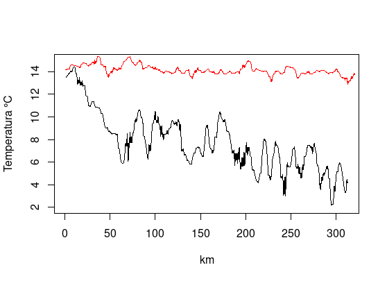

```{r setup, include=FALSE}
knitr::opts_chunk$set(echo = TRUE)
library(tidyverse) 
library(zoo)
```

# TECNICHE DI KRIGING: Parte 1 - Basi Teoriche {.Section1 .titlepage}

## Basi teoriche

Proprietà specifiche delle misure geostatistiche di **variabilità
spaziale**. Cosa si intende per variabilità spaziale? Cosa vogliamo
studiare?

In questo esempio usiamo un transetto (quello in rosso nella figura
sotto) della mappa di temperatura media della superficie del suolo del
2017 estratta da sensore MODIS\*

{style="float:left;"}



\*Il sensore MODIS non misura la temperatura dell'aria ma l'emissione di
calore delle superfici. Questa mappa è stata estratta con un fattore di
correzione molto generico per renderla più simile alla temperatura
dell'aria. Vedi [esercizio 01](esercizi/modulo2) per replicare
l'estrazione.

## Varianza

Vediamo come valutare alcuni momenti di una distribuzione - media e
varianza ci danno il primo e secondo momento. X è la variabile
aleatoria.


$$ M(X)=\mu_X=\mathbb E[X]$$

$$M(X)=\mu_X=\frac{1}{n}\sum_{j=1}^n x_j$$


$$Var(X)=\sigma^2_X=\mathbb{E}\Big[\big(X-\mathbb{E}[X]\big)^2\Big].$$
$$Var(X)=\sigma^2_X=\frac{\sum_i(x_i-M_X)^2}{n}$$
Formula più pratica

$$Var(X)=\sigma^2_X=\mathbb{E}[X^2]-\mathbb{E}[X]^2$$

$$Var(X)=\sigma^2_X=M(X^2)-M(X)^2 $$


## Varianza esempio

Carichiamo i valori del transetto e calcoliamo la varianza con tre formule diverse:

```{r  load}

load("esercizi/modulo2/data/modulo2.rda")
MX<-mean(t2) 
VarX <- var(t2)
MX2<-mean(t2^2) 
VarX2 <- MX2 - MX^2
VarX3 <- mean((t2-MX)^2)
 
paste("Media:", round(MX,3), " Varianza f1:", round(VarX,4), 
      " Varianzaf2:", round(VarX2,4), " Varianzaf3:", round(VarX3,4) )
 

plot(t2, xlab="km", ylab="temperatura", pch="+")
abline(a = MX,0 )
rect(0, MX-VarX^0.5, length(t2), 
     MX+VarX^0.5, col = "#ff000045", border = "#ffffff00")
# varianza  = (dev std)^2


```

## Covarianza

Tra due variabili, X e Y, come dice il nome stesso, se e quanto "variano insieme nella stessa direzione" (NB lineare e dello stesso segno).

$$\mathrm{Cov}(X,Y)=\mathbb{E}\Big[\big(X-\mathbb{E}[X]\big)(Y-\mathbb{E}[Y]\big)\Big]$$

```{r covar}

CovX<-cov(t2, t2)
CovX
VarX


```

## Covarianza (2)

MA se misuriamo come "Co-varia" con la misura subito dopo lungo il transetto?  Ovvero "trasliamo" di uno e correliamo con il dato originale

 
 
```{r covar2}
nm <- length(t2)
plot(t2[1:(nm-1)], type="l", xlab="km", ylab="temperatura") 
lines(t2[2:nm], col="red" )
cov(t2[1:(nm-1)], t2[2:nm] )
plot(t2[1:(nm-1)], t2[2:nm], pch="x" )

```


## Covarianza (3)

Più aumentiamo la distanza del lag, come è ragionevole pensare per dati spazialmente correlati, più diminuisce il valore di covarianza (si allontana dal valore della varianza == covarianza ).

```{r covar3}

plot(t2[1:(nm-1)], t2[2:nm], pch="x", cex=0.5, xlab="km", ylab="Temperatura" )
cc=1
covs<-list("0"=CovX, "1"=cov(t2[1:(nm-1)], t2[2:nm] ) )

for(lag in seq(6, 36, 10)){ 
  covs[[as.character(lag)]]<-cov(t2[1:(nm-lag)], t2[(lag+1):nm])
  points(t2[1:(nm-lag)], t2[(lag+1):nm], pch="x",cex=0.5, col=cc )
  cc=cc+1
}

plot(names(covs),  unlist(covs), type="b", 
     ylab="Varianza", 
     xlab="lag" )

```


## Covarianza (4)

Non ci crediamo? Rifacciamolo per un dato casuale con media e varianza uguale a quella del nostro dato:

```{r covar4}

t.rand <- rnorm(nm, mean = MX, sd = VarX^0.5)

plot(t.rand[1:(nm-1)], t.rand[2:nm], pch="x", cex=0.5, xlab="km", ylab="Temperatura" )
cc=1
covs.rand<-list("0"=cov(t.rand, t.rand), "1"=cov(t.rand[1:(nm-1)], t.rand[2:nm] ) )

for(lag in seq(6, 36, 10)){ 
  
  covs.rand[[as.character(lag)]] <- cov(t.rand[1:(nm-lag)], t.rand[(lag+1):nm])
  points(t.rand[1:(nm-lag)], t.rand[(lag+1):nm], cex=0.5, pch="x", col=cc )
  cc=cc+1
}

  
  
plot(names(covs.rand),  unlist(covs.rand), type="b", 
     ylab="Varianza", 
     xlab="lag" )

```


## Correlazione

Relazione lineare tra due variabili, cosiddetta di Pearson:

$$-1\le\rho_{XY}=\frac{Cov(XY)}{\sqrt{Var(X)}\cdot\sqrt{Var(Y)}}=\frac{\sum_{i=1}^n(X_i-\mu_X)(Y_i-\mu_Y)}{\sqrt{\sum_{i=1}^n(X_i-\mu_X)^2}\sqrt{\sum_{i=1}^n(Y_i-\mu_Y)^2}}\le+1$$


## Autocorrelazione

Come indicato nelle slide della Covarianza, indica quanto una variabile è correlata a se stessa data una modifica nel dominio dei valori. In una dimensione:


```{r autocorr}

  ccf(t2, t2)

```


## Fondamenti di algebra lineare nella regressione lineare


## Stazionarietà e isotropia

Si vuole studiare l'associazione tra le osservazioni della variabile
analizzata in funzione della distanza e della direzione. La funzione di
covarianza, il correlogramma e il variogramma (o semivariogramma) sono
tutte funzioni che caratterizzano numericamente la forza di tali
associazioni. Con la maggior parte dei dati spaziali, vengono fatte due
ipotesi comuni, stazionarietà ed isotropia.

1.  Stazionarietà: si ipotizza che la media e la varianza siano costanti
    nella regione di interesse
2.  Isotropia: l'autocorrelazione spaziale tra le risposte in 2 siti
    dipende solo dalla distanza e non dalla direzione o
    dall'orientamento. dipende solo dalla distanza e forse dalla
    direzione dell'orientamento, non dalla posizione di questi siti
    nella regione di interesse. siti sono situati nella regione di
    interesse.
3.  Continuità spaziale: l'autocorrelazione spaziale tra le risposte in
    2 siti dipende solo dalla distanza e forse dalla direzione
    dell'orientamento . dipende solo dalla distanza e forse dalla
    direzione dell'orientamento, non dalla posizione di questi siti
    nella regione di interesse. siti sono situati nella regione di
    interesse.

## Stazionarietà

L'ipotesi di stazionarietà è un fondamento per molte tecniche
geostatistiche, ma quasi sempre rappresenta una semplificazione della
realtà. La dimostrazione della stazionarietà in pratica è complesso, se
non impossibile per le seguenti ragioni:

1.  **Dati limitati:** I dati geostatistici sono tipicamente sparsi e
    irregolarmente distribuiti, rendendo difficile valutare le proprietà
    statistiche sull'intera area di studio.

2.  **Eterogeneità spaziale:** La maggior parte dei fenomeni naturali
    presenta una certa variabilità spaziale.

3.  **Dipendenza dalla scala:** I pattern spaziali possono cambiare con
    la scala, complicando la valutazione della stazionarietà.

### Approcci pratici per valutare la stazionarietà

Metodi per valutare il grado di stazionarietà:

-   **Analisi esplorativa dei dati (EDA):**

    -   Visualizzare i dati utilizzando istogrammi, scatter plot e mappe
        per identificare potenziali trend o pattern.

    -   Calcolare statistiche descrittive (media, varianza) per diversi
        sottoinsiemi dei dati per verificare la consistenza.

-   **Analisi del variogramma:**

    -   Esaminare il variogramma per evidenziare la stazionarietà (ad
        esempio, raggiungimento di un plateau, comportamento isotropo).

    -   Considerare l'adattamento di diversi modelli di variogramma per
        valutare la loro aderenza.

-   **Sottoinsiemi spaziali:**

    -   Dividere l'area di studio in sottoregioni più piccole e
        analizzare la stazionarietà in ciascuna sottoregione.

-   **Trasformazioni:**

    -   Applicare trasformazioni (ad esempio, logaritmo, radice
        quadrata) ai dati per migliorare la stazionarietà.

### Considerazioni importanti

-   **La stazionarietà è spesso un'approssimazione:** In pratica, spesso
    si assume una stazionarietà approssimativa per applicare i metodi
    geostatistici.

-   **Stazionarietà locale:** Può essere ragionevole assumere la
    stazionarietà all'interno di sottoregioni più piccole.

-   **Metodi non stazionari:** Se la stazionarietà è chiaramente
    violata, considerare l'utilizzo di metodi geostatistici non
    stazionari o altre tecniche di analisi spaziale.

**Ricorda:** L'obiettivo non è dimostrare la stazionarietà senza ombra
di dubbio, ma valutare la sua plausibilità e prendere decisioni
informate sull'adeguatezza dei metodi geostatistici

```{r}
varianze.fin30 <- rollapplyr(t2, 30, var, by.column = FALSE, fill = NA)
medie.fin30 <- rollapplyr(t2, 30, mean, by.column = FALSE, fill = NA)

plot(medie.fin30)
plot(varianze.fin30)

```

## Approcci per “rilassare” le condizioni

dddd

## Fondamenti statistici dell’analisi spaziale

ìììì

## Variabili regionalizzate

ffff

# TECNICHE DI KRIGING: Parte 2 - Analisi spaziale dei dati {.Section1 .titlepage}

## Metodi deterministici

(inverso pesato sulla distanza

## Kriging

tecnica di interpolazione "esatta" che onora i punti - ma anche le medie
nell'area Bayesiana di maggiore probabilità ()

-   attenti: si presuppone un processo stocastico "stazionario", ovvero:

    -   media costante in tutta l'area analizzata

    -   la varianza delle differenze dei valori analizzati dipende solo
        dalla **distanza** tra coppie di punti e non dalla loro
        posizione

[](https://en.wikipedia.org/wiki/Kriging)

## Kriging: tipologie

Importante dividere in tre gruppi il Kriging (K) per scegliere quello
corretto:

-   **Simple K** - si presuppone una media costante nota nell'area di
    lavoro

-   **Ordinary K** - si presuppone una media costante ma ignota

-   **Universal K** - si presuppone una media ignota non costante ma con
    un trend lineare

## Covarianza, correlogramma

jjj

## Variogramma

Il semivariogramma... \|h\| indica la distanza

[![Esempio di semivariogramma [vedi
https://doi.org/10.14214/sf.369]](images/clipboard-110321721.png)](https://www.silvafennica.fi/article/369)

## Kriging variance, come viene calcolata

ff

## Studio variografico di una variabile georeferenziata

ff

## Variogramma sperimentale

ff

## Modello di variogramma: range, sill e nugget

ff

## Effetto nugget

fff

# TECNICHE DI KRIGING: Parte 3 - Diversi Kriging {.Section1 .titlepage}

## Ordinary Kriging (OK)

kkk

## Universal Kriging (UK)

kkkk

## Co-Kriging (CK)

kkkk

## External drift Kriging (KED)

kkkk

## Regression Kriging (RK)

kkkk

## Indicator Kriging (IK)

kkkkk
