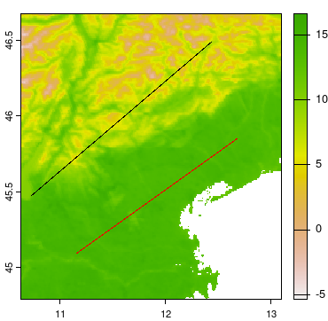
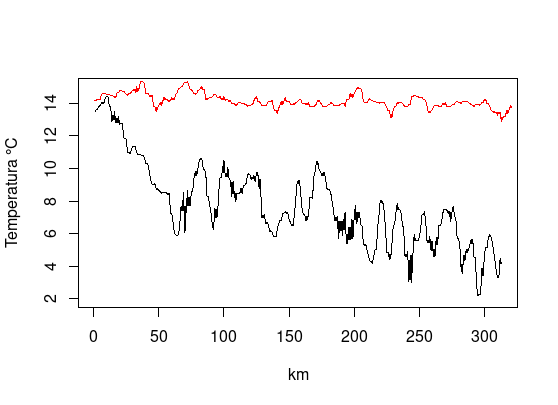
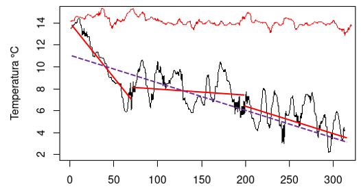
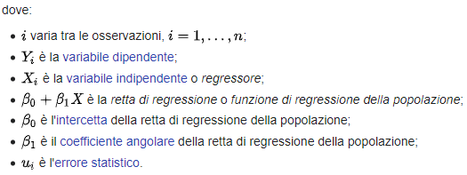
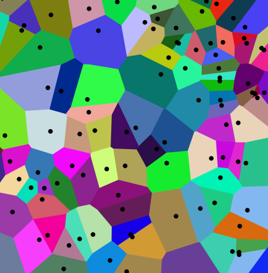
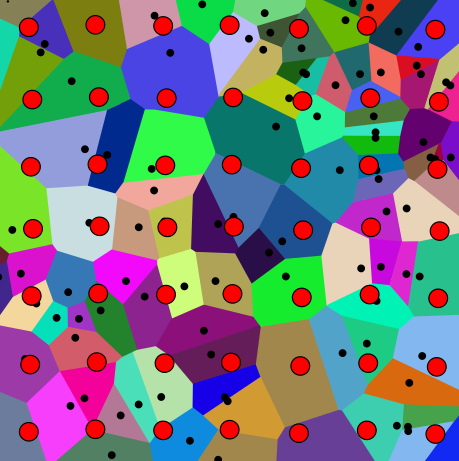
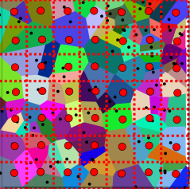
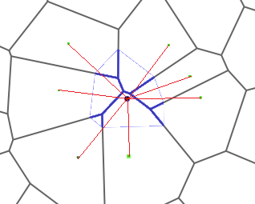

```{r setup, include=FALSE}
knitr::opts_chunk$set(echo = TRUE)
library(tidyverse) 
library(zoo)
library(ggplot2)
library(gstat)
library(sp)
suppressMessages(library(sjPlot))
```

## Riferimenti utili

CRS - coordinate reference system\
<https://r.geocompx.org/spatial-class#crs-intro>\
<https://r-spatial.org/book/02-Spaces.html#sec-crs>\
\
meuse dataset\
<https://cloud.r-project.org/web/packages/gstat/vignettes/gstat.pdf>\
\
metodi di interpolazione geografica\
<https://r-spatial.org/book/12-Interpolation.html>

## Basi teoriche

Proprietà specifiche delle misure geostatistiche di **variabilità
spaziale**. Cosa si intende per variabilità spaziale? Cosa vogliamo
studiare?

Vogliamo un modello per "spiegare" la variabilità e dunque poter stimare
(interpolare) al meglio dove non abbiamo informazioni.

Stimare valori di una variabile applicando un modello creato conoscendo
valori misurati (e.g. campionamenti). E' ragionevole adottare un
criterio spaziale, ovvero usare un criterio di spazio (il valore del
punto sarà probabilmente più simile ad una misura vicina che una misura
più lontana, [**a parità di altre condizioni)**]{.underline}. Da qui la
geostatistica.

::: caption

:::

## Dati di esempio

VEDI anche <https://www.cirgeo.unipd.it/app01/GeospatialApp/>

E' possibile costruire un modello di regressione utilizzando le
coordinate dei dati come covariate per descrivere la variazione spaziale
della variabile di interesse. In molti casi, per descrivere
adeguatamente l'effetto della posizione sarà necessaria una funzione
**non** lineare basata sulle coordinate.

In questo esempio usiamo due transetti: t1=nero, t2=rosso estratti dalla
della mappa di temperatura media della superficie del suolo del 2017
estratta da sensore MODIS\*. Carichiamo i valori di temperatura dei due
transetti:

```{r transect }
suppressMessages(library(terra))
load("esercizi/modulo2/data/modulo2.rda")
modisTemp <- terra::rast("esercizi/modulo2/data/VenetoCorrectedMODIS_LST_Avg2017.tif")
```

```{r transectb, eval=FALSE }
plot(modisTemp)
plot(t1, type="l", xlab="km", ylab="temperatura", ylim=c(0,15)) 
lines(t2, col="red" )
legend(270, 4, "t1", box.col = "lightgrey", bg = "#cccccc44" )
legend(270, 14, "t2", box.col = "red", bg = "#ff000044" )

```

{style="float:left;"}

```{r transect2, echo=FALSE}
plot(t1, type="l", xlab="km", ylab="temperatura", ylim=c(0,15)) 
lines(t2, col="red" )
legend(270, 4, "t1", box.col = "lightgrey", bg = "#cccccc44" )
legend(270, 14, "t2", box.col = "red", bg = "#ff000044" )

```

\*Il sensore MODIS non misura la temperatura dell'aria ma l'emissione di
calore delle superfici. Questa mappa è stata estratta con un fattore di
correzione molto generico per renderla più simile alla temperatura
dell'aria. Vedi [esercizio
01](esercizi/modulo2/modulo2_es01_transetti.R) per replicare
l'estrazione.

## Varianza

Vediamo come valutare alcuni momenti di una distribuzione - media e
varianza ci danno il primo e secondo momento. Z è la variabile
aleatoria, nel nostro caso la temperatura.

$$M(Z)=\mu_Z=\mathbb E[Z]$$

$$M(Z)=\mu_Z=\frac{1}{n}\sum_{j=1}^n{Z_j}$$

$$Var(Z)=\sigma^2_Z=\mathbb{E}\Big[\big(Z-\mathbb{E}[Z]\big)^2\Big].$$

$$Var(Z)=\sigma^2_Z=\frac{\sum_{j=1}^n(Z_j-M_Z)^2}{n}$$

Formula più pratica

$$Var(Z)=\sigma^2_Z=\mathbb{E}[Z^2]-\mathbb{E}[Z]^2$$

$$Var(Z)=\sigma^2_Z=M(Z^2)-M(Z)^2 $$

## Varianza esempio

Calcoliamo la varianza con tre formule diverse:

```{r  load}

MX<-mean(t2) 
VarX <- var(t2)
MX2<-mean(t2^2) 
VarX2 <- MX2 - MX^2
VarX3 <- mean((t2-MX)^2)
 
paste("Media:", round(MX,3), " Varianza f1:", round(VarX,4), 
      " Varianzaf2:", round(VarX2,4), " Varianzaf3:", round(VarX3,4) )
 

plot(t2, xlab="km", ylab="temperatura", pch="+")
abline(a = MX,0 )
rect(0, MX-VarX^0.5, length(t2), 
     MX+VarX^0.5, col = "#ff000045", border = "#ffffff00")
# varianza  = (dev std)^2


```

## Varianza esempio (2)

```{r varianza2}

hist(t2)
rug(t2)
rect(MX-VarX^0.5, 10000, 
     MX+VarX^0.5, 0, col = "#ff000045", border = "#ffffff00")
abline(v=MX, col="red", lwd=2)


```

## Covarianza {#covarianza}

Tra due variabili, Z1 e Z2, come dice il nome stesso, se e quanto
"variano insieme nella stessa direzione" (NB lineare e dello stesso
segno).

$$\mathrm{Cov}(Z1,Z2)=\mathbb{E}\Big[\big(Z1-\mathbb{E}[Z1]\big)(Z2-\mathbb{E}[Z2]\big)\Big]$$

```{r covar}

CovX<-cov(t2, t2)
CovX
VarX

```

## Covarianza (2)

MA se misuriamo come "Co-varia" con la misura subito dopo lungo il
transetto? Ovvero "trasliamo" di uno lungo X e correliamo con il dato
originale...

```{r covar2}
nm <- length(t2)
plot(t2[1:(nm-1)], type="l", xlab="km", ylab="temperatura") 
lines(t2[2:nm], col="red" )
cov(t2[1:(nm-1)], t2[2:nm] )
plot(t2[1:(nm-1)], t2[2:nm], pch="x" )

```

## Covarianza (3) {#covarianza-3}

Più aumentiamo la distanza del lag, come è ragionevole pensare per dati
spazialmente correlati, più diminuisce il valore di covarianza (si
allontana dal valore della varianza == covarianza ).

Se si abbassa per poi rialzarsi, può indicare un pattern ricorrente
(provate sostituendo i valori di t2 con un valore ciclico come
`t2 <- sin((1:200)/10)` .

```{r covar3}

plot(t2[1:(nm-1)], t2[2:nm], pch="x", cex=0.5, xlab="km", ylab="Temperatura" )
cc=1
covs<-list("0"=CovX, "1"=cov(t2[1:(nm-1)], t2[2:nm] ) )

for(lag in seq(6, nm, 5)){ 
  covs[[as.character(lag)]]<-cov(t2[1:(nm-lag)], t2[(lag+1):nm])
  points(t2[1:(nm-lag)], t2[(lag+1):nm], pch="x",cex=0.5, col=cc )
  cc=cc+1
}

plot(names(covs),  unlist(covs), type="b", 
     ylab="Co-Varianza", 
     xlab="lag" )

```

## Covarianza (4) {#covarianza-4}

Non ci crediamo? Rifacciamolo per un dato casuale con media e varianza
uguale a quella del nostro dato:

```{r covar4}

t.rand <- rnorm(nm, mean = MX, sd = VarX^0.5)

plot(t.rand[1:(nm-1)], t.rand[2:nm], pch="x", cex=0.5, xlab="km", ylab="Temperatura" )
cc=1
covs.rand<-list("0"=cov(t.rand, t.rand), "1"=cov(t.rand[1:(nm-1)], t.rand[2:nm] ) )

for(lag in seq(6, 36, 10)){ 
  covs.rand[[as.character(lag)]] <- cov(t.rand[1:(nm-lag)], t.rand[(lag+1):nm])
  points(t.rand[1:(nm-lag)], t.rand[(lag+1):nm], cex=0.5, pch="x", col=cc )
  cc=cc+1
}

  
  
plot(names(covs.rand),  unlist(covs.rand), type="b", 
     ylab="Varianza", 
     xlab="lag" )

```

## Correlazione

Relazione lineare tra due variabili, cosiddetta di Pearson.
Semplicemente normalizza per le deviazioni standard:

$$-1\le\rho_{Z1Z2}=\frac{Cov(Z1Z2)}{\sqrt{Var(Z1)}\cdot\sqrt{Var(Z2)}}=\frac{\sum_{i=1}^n(Z1-{\mu_{Z1}})(Z2-{\mu_{Z2}})}{\sqrt{\sum_{i=1}^n(y_i-{\mu_{Z1}})^2}\sqrt{\sum_{i=1}^n(y_i-{\mu_{Z2}})^2}}\le+1$$

## Autocorrelazione

Come indicato anche nelle slide della Covarianza ([Covarianza
(3)](#covarianza-3) e [Covarianza (4)](#covarianza-4)), indica quanto
una variabile è correlata a se stessa data una modifica nel dominio dei
valori. In una dimensione, che sia tempo o spazio come nel nostro
transetto, si dice anche "lag" che può essere tradotto come "sfasamento"
delle linee nel dominio spaziale o temporale. Viene analizzato con la
funzione CCF :

```{r autocorr}

  #ccf(t2, t2, plot = F)
  ccf(t2, t2)

```

## Fondamenti di algebra lineare nella regressione lineare

Perchè iniziamo con la regressione lineare? Perchè molti fenomeni sono
affetti da "trend" o tendenze di segno positivo o negativo. Ovvero
all'aumentare di X la variabile Z aumenta o diminuisce (correlazione
positiva o negativa). Vediamo i nostri 2 plot dei 2 transetti...

{style="float:left;"}


## Fondamenti di algebra lineare nella regressione lineare (2)

E' chiaro che ci sia un trend molto marcato nel transetto 1 (linea
nera)... è dato dalla evidente correlazione tra temperatura e quota,
muovendoci verso nord direttamente si intercettano le Alpi. Nota che ci
possono essere trend diversi a seconda della finestra considerata nel
dominio X. Come facciamo a capirlo?

{style="float:left;"}


## Fondamenti di algebra lineare nella regressione lineare (3)

Un metodo noto è il metodo dei minimi quadrati per stimare un modello
lineare che "spiega" al meglio i valori osservati minimizzando gli
errori espressi in valore assoluto o come quadrato degli scarti sotto
illustrato\*

$$Z_i = \beta_0 + \beta_1 X_i + u_i$$



\*fonte: [wikipedia](https://it.wikipedia.org/wiki/Regressione_lineare)

## Fondamenti di algebra lineare nella regressione lineare (4)

Modelli lineari, nei pacchetti di base, (lm) emodelli lineari robusti,
nel pacchetto MASS (rlm). Questi hanno un:

-   lato sinistro: variabile/i (matematicamente) dipendente/i
-   Operatore di formula \~, letto come "dipende da", "è funzione di".
-   lato destro: variabile (matematicamente) indipendente (o variabili)

```{r lineareReg }

dati<- data.frame(Temperatura=t2, Distanza_Km=1:length(t2) )
# modello.lm <- lm(data = dati)
modello.lm <- lm(Temperatura~Distanza_Km, data = dati)
#summary(modello.lm)
# per riportare i parametri del modello meglio usare sjPlot ---- 
sjPlot::tab_model(modello.lm)

```

## Fondamenti di algebra lineare nella regressione lineare (5)

Modelli: Il lato destro può avere operatori che sembrano aritmetici ma
sono interpretati in termini di struttura del modello:

-   `+` effetto additivo

-   `*` effetto di interazione

-   `/` modello annidato

-   `-` rimuovere i termini dal modello

Per le formule aritmetiche all'interno del modello, è necessario
utilizzare la funzione I "identità".

Per illustrare l'uso degli operatori, ecco un modello della temperatura
che è funzione di una potenza della quota.

```{r lineareRegPlot }

ggplot(dati, aes(x = Distanza_Km, y = Temperatura)) + 
  geom_point() +
  stat_smooth(method = "lm") + theme_bw()
```

## Let's go SPATIAL

Invece del transetto campioniamo dei punti di temperatura e quota. Vedi
[Esercizio 3 del Modulo 2](esercizi/modulo2/modulo2_es03_goSpatial.R)
"modulo2_es03_goSpatial.R".

Per illustrare l'uso degli operatori e delle identità, proviamo modelli
di temperatura funzione di varie potenze della quota e vediamo quello
più performante.

```{r spaceRegPlot }
## leggiamo la quota
temp <- terra::rast("GeospatialApp/data/VenetoCorrectedMODIS_LST_Avg2017.tif")
## aggiungiamo una potenziale covariata - la quota!
DEM <- terra::rast("GeospatialApp/data/VenetoDEM.tif")
smpl <- terra::spatSample(temp, method="random",
                        size=2000, na.rm=T, xy=T ) #as.points=T
## NB quota in km! poi vediamo perchè
smpl$altitude <- terra::extract(DEM, smpl[,1:2], ID=F )[[1]]/1000
smpl$altitudeM <- terra::extract(DEM, smpl[,1:2], ID=F )[[1]]
names(smpl)
names(smpl)<-c("x","y","Temp", "Quota.km", "Quota.m") 
smpl<-as_tibble(smpl) 

```

## Regressioni tra covariate

```{r spaceRegPlot2 }


modello.lm <- lm(Temp~`Quota.km`, data = smpl) 
sjPlot::tab_model(modello.lm)

modello.lm <- lm(Temp~`Quota.m`, data = smpl) 
sjPlot::tab_model(modello.lm)

modello.lm <- lm(Temp~I(`Quota.km`^0.5), data = smpl) 
sjPlot::tab_model(modello.lm)

ggplot(smpl, aes(x = `Quota.km`, y = Temp)) + 
  geom_point() +
  stat_smooth(data=smpl, method = "lm", formula = y~I(x^0.5) )  + theme_bw()
 
```

## Stazionarietà e isotropia

L'interpolazione con kriging si basa su alcune assunzioni fondamentali
riguardo alla natura dei dati spaziali. Tra queste, le più importanti
sono la stazionarietà e l'isotropia.

I due presupposti principali affinché il kriging fornisca la migliore
previsione lineare imparziale sono quelli della stazionarietà e
dell'isotropia, sebbene esistano varie forme e metodi di kriging che
consentono di allentare la forma più rigorosa di ciascuno di questi
presupposti. Tuttavia, nella realtà, queste condizioni sono spesso
violate, rendendo necessario adottare approcci più flessibili.

1.  Stazionarietà "formale": le proprietà statistiche del processo
    spaziale rimangono costanti in tutte le località. La distribuzione
    di probabilità congiunta non varia nello spazio di studio. Di
    conseguenza, i parametri (come la media complessiva dei valori,
    l'intervallo e la soglia del variogramma) non variano nello spazio
    di studio. Si presume che lo stesso modello di variogramma sia
    valido in tutto lo spazio di studio. Si tratta di un'ipotesi che
    raramente si verifica nei dati del mondo reale.
2.  Stazionarietà "debole": si ipotizza che la media e la
    varianza/covarianza siano costanti nella regione di interesse
3.  Isotropia: l'autocorrelazione spaziale tra le risposte in 2 siti
    dipende solo dalla distanza e non dalla direzione o
    dall'orientamento. dipende solo dalla distanza e forse dalla
    direzione dell'orientamento, non dalla posizione di questi siti
    nella regione di interesse. siti sono situati nella regione di
    interesse.
4.  Continuità spaziale: l'autocorrelazione spaziale tra le risposte in
    2 siti dipende solo dalla distanza e forse dalla direzione
    dell'orientamento non dalla posizione di questi siti nella regione
    di interesse. siti sono situati nella regione di interesse.

## Stazionarietà

La caratteristica di stazionarietà è fondamentale per molte tecniche
geostatistiche

[Stazionarietà di primo ordine]{.underline}: stazionarietà della media,
ovvero un campione in due aree diverse della regione di studio hanno
media uguale.

[Stazionarietà di secondo ordine]{.underline}: stazionarietà della
varianza, ovvero un campione in due aree diverse della regione di studio
hanno varianza uguale.

Quasi sempre rappresenta una semplificazione della realtà.

La dimostrazione della stazionarietà in pratica è complesso per le
seguenti ragioni:

1.  **Dati limitati:** I dati geostatistici sono tipicamente sparsi e
    irregolarmente distribuiti, rendendo difficile valutare le proprietà
    statistiche sull'intera area di studio.

2.  **Eterogeneità spaziale:** La maggior parte dei fenomeni naturali
    presenta una certa variabilità spaziale.

3.  **Dipendenza dalla scala:** I pattern spaziali possono cambiare con
    la scala, complicando la valutazione della stazionarietà.

Siccome abbiamo simulato un dataset completo, vediamo effettivamente la
difficoltà nel soddisfare queste condizioni:


## Stazionarietà: Approcci pratici

Metodi per valutare il grado di stazionarietà:

-   **Analisi esplorativa dei dati (EDA):**

    -   Visualizzare i dati utilizzando istogrammi, scatter plot e mappe
        per identificare potenziali trend o pattern.

    -   Calcolare statistiche descrittive (media, varianza) per diversi
        sottoinsiemi dei dati per verificare la consistenza.

-   **Analisi del variogramma:**

    -   Esaminare il variogramma per evidenziare la stazionarietà (ad
        esempio, raggiungimento di un plateau, comportamento isotropo).

    -   Considerare l'adattamento di diversi modelli di variogramma per
        valutare la loro aderenza.

## Stazionarietà: Considerazioni importanti

-   **La stazionarietà è spesso un'approssimazione:** In pratica, spesso
    si assume una stazionarietà approssimativa per applicare i metodi
    geostatistici.

-   **Stazionarietà locale:** Può essere ragionevole assumere la
    stazionarietà all'interno di sottoregioni più piccole.

-   **Metodi non stazionari:** Se la stazionarietà è chiaramente
    violata, considerare l'utilizzo di metodi geostatistici non
    stazionari o altre tecniche di analisi spaziale.

**Ricorda:** L'obiettivo non è dimostrare la stazionarietà senza ombra
di dubbio, ma valutare la sua plausibilità e prendere decisioni
informate sull'adeguatezza dei metodi geostatistici

## Stazionarietà: esercizio

Testiamo sul transetto n. 2 (T2 ovvero quello rosso).

Poi provato con T1, quali dei due processi è "più stazionario"?

[Esercizio 2 del Modulo 2](esercizi/modulo2/modulo2_es02_trend.R)


```{r}
varianze.fin30 <- rollapplyr(t2, 30, var, by.column = FALSE, fill = NA)
medie.fin30 <- rollapplyr(t2, 30, mean, by.column = FALSE, fill = NA)

plot(medie.fin30)
plot(varianze.fin30)


```

## Test di stazionarietà - variogramma

Insomma... i miei dati 2D soddisfano il presupposto di stazionarietà o
no? O almeno quanto sono lontani da una perfetta stazionarietà?

NB - La stazionarietà è una decisione, non un'ipotesi (cit. M. Pyrcz);
pertanto non può essere testata. I dati possono dimostrare che non è una
supposizione appropriata.

La valutazione della stazionarietà dipende dalla scala. La scelta della
scala deve basarsi sul problema specifico.


Per indagare/valutare la stazionarietà dei dati spaziali, in pratica la
cosa migliore è usare un **variogramma o un autocorrelogramma**: - nel
primo caso è un grafico che mostra come aumenta la covarianza a diversi
lag.

## Variogramma {#variogramma}

Immagina di avere una mappa che mostra il valore di una variabile (e.g.
temperatura). I valori varieranno da punto a punto, e questa variabilità
non è casuale: punti vicini tendono ad avere valori più simili rispetto
a punti lontani. Il variogramma è uno strumento grafico che permette di
visualizzare e quantificare questa relazione tra la distanza e la
variabilità di un fenomeno spaziale.

Per ogni coppia di punti a una determinata distanza, si calcola la metà
della differenza al quadrato dei loro valori. Questa quantità è chiamata
**semivarianza**. Il variogramma mette nell'asse X la distanza e
nell'asse Y la semivarianza.

Elementi:

-   **Nugget:** Il valore iniziale del variogramma, indica la
    variabilità a brevissima distanza. Un nugget elevato suggerisce una
    componente casuale significativa.

-   **Sill:** Il valore massimo a cui tende il variogramma, rappresenta
    la variabilità totale.

-   **Portata:** La distanza alla quale il variogramma raggiunge il
    sill, indica la distanza oltre la quale i valori sono considerati
    indipendenti.

Il variogramma si dice delimitato se raggiunge un massimo tetto (sill)
di varianza e si può decidere che i dati sono stazionari, ma se il
variogramma non è delimitato (non raggiunge un massimo) .

Proviamo con il nostro transetto...

```{r variogrammaTransetto}
dati = data.frame(Temperatura=t2)
dati$X=1:nrow(dati)
dati$Y=1:nrow(dati)
coordinates(dati)<-  ~X+Y
 
vr=gstat::variogram(Temperatura~1, data=dati)
plot(vr)

vr=gstat::variogram(Temperatura~1, data=dati, width=3)
plot(vr)
 
vr=gstat::variogram(Temperatura~1, data=dati,alpha=90, width=3)
plot(vr)
```

## Autocorrelogramma

nel secondo caso è un grafico che mostra l'autocorrelazione dei valori
dei dati a diversi lag (spaziali o temporali).

Si vuole studiare l'associazione tra le osservazioni della variabile
analizzata in funzione di distanza e direzione. Le funzioni di
[covarianza](#covarianza), il [correlogramma](#correlogramma) e il
[variogramma](#variogramma) / il [semivariogramma](#semivariogramma)
sono tutte funzioni che caratterizzano numericamente la forza di tali
associazioni.

## Stazionarietà - variogramma

Il variogramma può aiutare a decidere se il

**Forma coerente:** La forma complessiva del variogramma (ad esempio,
sferica, esponenziale) deve rimanere coerente in diverse parti dell'area
di studio.

**Nessuna tendenza sistematica:** Il variogramma non deve presentare
tendenze chiare verso l'alto o verso il basso all'aumentare della
distanza.

**Nessuna dipendenza dalla posizione:** Il variogramma non deve variare
in modo significativo a seconda della posizione delle coppie di punti
all'interno dell'area di studio.

```{r}
library(gstat)
 
myplots<-function(vrs){
  add=F
  for(name in names(vrs)){
    vr <- vrs[[name]]
      col=runif(1,min=1,max=10)
  pch=runif(1,min=1,max=10)
  if(!add) { 
    plot(vr$dist/1000, vr$gamma, xlab="Distanza (km)", ylab="semivariance",col=col, 
       pch=pch)
  }
  else {
    points(vr$dist, vr$gamma,col=col, 
       pch=pch)
    
  } 
  legend(min(vr$dist/1000), max(vr$gamma),bty = "n", name, col=col,  pch=pch  )
  }
 add=T
}

## trasformiamo da terra vect a oggetto sf, poi 
## lo proiettiamo su un sistema cartografico
## https://epsg.io/3035 
## per avere le distanze in metri  
smpl.spat <- smpl %>% sf::st_as_sf(coords = c("x","y"), crs=4326) %>%   
                      sf::st_transform(3035)  
plots  <- list() 
plots[["Temp~1"]]  <- gstat::variogram(Temp~1, smpl.spat)
 
smpl.spat$x<- sf::st_coordinates(smpl.spat)[,1]
smpl.spat$y<- sf::st_coordinates(smpl.spat)[,2]

## decisione di stazionarietà migliorata, variagramma con sill. 
plots[["Temp~x+y"]] <-  gstat::variogram(Temp~x+y, na.omit(smpl.spat))
 
 
plots[["Temp~Quota.km"]] <- gstat::variogram(Temp~Quota.km, data=as.data.frame(na.omit(smpl)), locations = ~x+y  )

plots[["Temp~Quota.km+x+y"]] <- gstat::variogram(Temp~Quota.km+x+y, na.omit(smpl.spat))

myplots(plots)

```

## Test di stazionarietà - variogramma (3)

Vedi portale interattivo [Geospatial
App](https://www.cirgeo.unipd.it/app01/GeospatialApp/){target="_blank"}

## Isotropia

Direzionalità - si può testare fornendo un valore di *alpha* al
variogramma.

```{r anisotropy }

vra <- gstat::variogram(Temp~1, na.omit(smpl.spat), alpha=seq(0,360, 20) )
sp::plot(vra)

```

## Rilassare” le condizioni - **stazionarietà**

Trend spaziale: Si introduce un trend deterministico per modellare
variazioni sistematiche della media. E.g. Se troviamo delle covariate
(e.g. quota che spiega la temperatura) possiamo inserirle nel modello
per eliminarne gli effetti ed isolare unicamente l'effetto spaziale
separandolo da quello di altre covariate.

Covarianza locale: Si stimano parametri di covarianza diversi per
diverse regioni dello spazio.

Decomposizione della varianza: Si scompone la varianza in componenti
stazionarie e non stazionarie.

Applicazione di trasformazioni matematiche ai dati per renderli più
stazionari (es. logaritmo, potenza).

Modelli geostatistici più complessi che tengano conto della non
stazionarietà (Kriging specifico).

Analisi locale: Dividere lo spazio in sottoregioni più omogenee e
analizzare separatamente il variogramma in ciascuna sottoregione

## Rilassare” le condizioni - **isotropia**

Trasformare le coordinate e.g. Si ruota il sistema di riferimento in
modo che gli assi coincidano con le direzioni principali di anisotropia.
In questo modo, si può ottenere un variogramma più circolare nelle nuove
coordinate.

Utilizzare modelli di variogramma anisotropi più semplici, come quelli
con un angolo di rotazione fisso o con un'anisotropia geometrica.

## Variabili regionalizzate

Sono grandezze il cui valore dipende dalla localizzazione ovvero dal
vettore delle [X Y] di coordinate spaziali.

La teoria delle variabili regionalizzate non utilizza
l'autocorrelazione, ma una proprietà correlata chiamata semivarianza per
esprimere il grado di relazione tra i punti di una superficie.

La semivarianza è semplicemente la metà della varianza delle differenze
tra tutti i possibili punti distanziati da una distanza costante.

La semivarianza a una distanza d = 0 dovrebbe essere pari a zero, perché
non ci sono differenze tra punti che vengono confrontati con se stessi.
Tuttavia, man mano che i punti vengono confrontati con punti sempre più
distanti, la semivarianza aumenta. A una certa distanza, chiamata
intervallo,

la semivarianza diventerà approssimativamente uguale alla varianza della
superficie stessa. Si tratta della massima distanza su cui il valore di
un punto della superficie è correlato al valore di un altro punto.
L'intervallo definisce il massimo vicinato su cui selezionare i punti di
controllo per stimare un nodo della griglia, per sfruttare la
correlazione statistica tra le osservazioni. Nel caso in cui il nodo
della griglia e le osservazioni siano distanziate in modo tale che tutte
le distanze superino l'intervallo, il kriging produce la stessa stima
della statistica classica, ovvero la media.

## Finestra

Quando si lavora con un set di punti, è necessario specificare la
regione spaziale o la finestra in cui si analizza il modello.

Nel modulo **spatstat**, la finestra di osservazione è una parte parte
integrante del lavoro.

Un modello serve per stimare valori della variabile di studio in punti
dove non sono presenti osservazioni. Anche qualcosa di semplice come la
stima della distribuzione a pattern (raggruppate, casuali o griglia)
dipende dalla finestra di osservazione considerata.

I risultati saranno diversi analizzando finestre diverse. Ad esempio,
calcolando la finestra di osservazione mediante l'area convessa dei
punti.

Solitamente la finestra di osservazione è un rettangolo, quindi basta
specificare le dimensioni x e y del rettangolo ed i vertici.

Finestre di osservazione con una forma più complessa possono essere
facilmente rappresentate in **spatstat**, come descritto di seguito. Per
le situazioni in cui la finestra è davvero sconosciuta, **spatstat**
inltre fornisce la funzione *ripras* per calcolare lo stimatore di
Ripley-Rasson della finestra, data solo la posizione dei punti.

# Interpolazione {.Section1 .titlepage}

## Metodi deterministici vs stocastici

I metodi deterministici non considerano la componente aleatoria dei
dati, ma si basano su assunzioni deterministiche per stimare i valori in
punti non campionati

Vogliamo dunque stimare il valore Z\* in un punto dove non abbiamo una
misura. Utilizziamo misure vicine, ma come?

$$Z* = F(x,y) = \sum_{i=2}^n w_i Z_i$$ dove il peso del punto $1$
dipende dalla distanza $h$ di un $i-esimo$ numero di punti $n$

## Vicino più prossimo (Nearest Neighbour - NN)

Semplicemente quello più vicino\
$$ Z*= Z_i $$ Dove $Z_i$ è il vicino più prossimo e $Z_*$ il punto da
interpolare

{width="250"}
{width="250"}
{width="250"}
{width="250"}

## Vicino Naturale (Natural Neighbour - NatN)

poligoni di Thiessen danno l'area di influenza.

$$ Z*= Z_i $$ dove ilpeso è indicato da Sibson

$$
Z_i(\mathbf{x})=\frac{A(\mathbf{x}_i)}{A(\mathbf{x})}
$$

dove $A(x)$ è il volume della nuova cella centrata in x e A(xi) è il
volume dell'intersezione tra la nuova cella centrata in x e la vecchia
cella centrata in xi.


-   interpolatore esatto: i valori dei dati originali vengono mantenuti
    nei punti di riferimento.

-   crea una superficie liscia priva di discontinuità.

-   è interamente locale, in quanto si basa su un sottoinsieme minimo di
    posizioni dei dati che esclude le posizioni che, pur essendo vicine,
    sono più distanti di un'altra posizione in una direzione simile.

-   è adattivo dal punto di vista spaziale e si adatta automaticamente
    alle variazioni locali della densità dei dati o della disposizione
    spaziale.

-   privo di ipotesi statistiche (puramente deterministico).

-   può essere applicato a insiemi di dati molto piccoli, poiché non è
    basato su dati statistici.

-   privo di parametri, quindi semplice

## Inverso pesato sulla distanza (IWD)

$$Z* = F(x,y) = \sum_{i=2}^n w_i Z_i$$ dove il peso dipende dalla
distanza $h$

$$w_i = \frac {h_i^{-p}}{\displaystyle \sum_{j=i}^n h_j^{-p}}$$

e da una potenza $p$ che va inserita dall'utente e può essere oggetto di
ottimizzazione.

::: caption

:::
