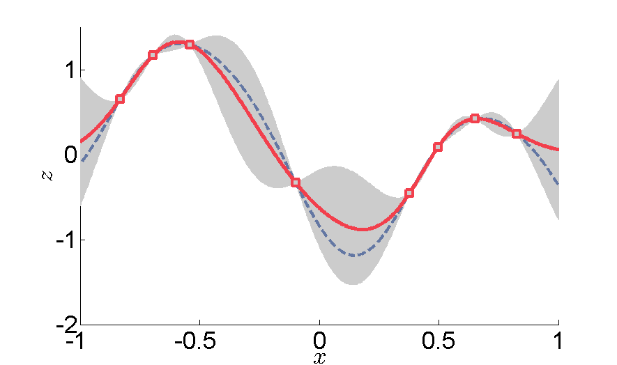

# TECNICHE DI KRIGING: Parte 2 - Analisi spaziale dei dati {.Section1 .titlepage}

## Metodi stocastici - Kriging

tecnica di interpolazione "esatta" che onora i punti - ma anche le medie
nell'area Bayesiana di maggiore probabilità (zona grigia nella figura)

-   attenti: si presuppone un processo stocastico "stazionario", ovvero:

    -   media costante in tutta l'area analizzata

    -   la varianza delle differenze dei valori analizzati dipende solo
        dalla **distanza** tra coppie di punti e non dalla loro
        posizione

## Kriging: tipologie

### Geostatistica uni-(co)variata

Una variabile sola considerata o con multivariata (co-kriging)

-   **Simple K** - si presuppone una media costante nota nell'area di
    lavoro

-   **Ordinary K** - si presuppone una media costante ma ignota

-   **Universal K** - si presuppone una media ignota non costante ma con
    un trend lineare

## Semivariogramma

Grafico dove in X c'è la distanza tra ogni coppia di punti nel dataset,
ed in Y il valore

Il semivariogramma è un grafico della semivarianza in funzione della
distanza tra le osservazioni ed è la fonte di informazioni utilizzata
nel kriging per ottenere funzioni di ponderazione ottimali per la
mappatura. Il kriging utilizza il semivariogramma, o meglio un modello
matematico del semivariogramma, per calcolare le stime della superficie
ai nodi della griglia. Queste stime di kriging sono le migliori stime
lineari oggettive della superficie nelle posizioni specificate, a
condizione che la superficie sia stazionaria e che sia stata determinata
la forma corretta del semivariogramma.

$$
\gamma(h) = 0.5 * average((Z_i – Z_j)^2)^*
$$

\*per coppia di punti $Z$ a distanza $h$

## Semivariogramma

Ogni punto della nuvola rappresenta una coppia di punti nel set di dati,
quindi il numero di punti nella nuvola aumenterà rapidamente
all'aumentare del numero di punti nel set di dati. Per n punti nel set
di dati, la nuvola di semivariogramma/covarianza visualizzerà

$$\frac{n*(n-1)}{2}$$

punti. Per questo motivo, non è consigliabile utilizzare set di dati con
più di qualche migliaio di punti.

## Semivariogramma

Il semivariogramma... \|h\| indica la distanza di lag dove la covarianza
rimane costante. Questo viene rappresentato in modelli

[![Esempio di semivariogramma [vedi
https://doi.org/10.14214/sf.369]](images/clipboard-110321721.png)](https://www.silvafennica.fi/article/369)

## Modelli di variogramma

## Modelli di variogramma (2)

## Modello di variogramma: range, sill e nugget

## Effetto nugget

E' la varianza indipendente dall'autocorrelazione spaziale. Ad esempio
dovuta agli errori di misura.

# TECNICHE DI KRIGING: Parte 3 - Diversi Kriging {.Section1 .titlepage}

## Ordinary & Simple Kriging (OK)

Ordinary: Assume che la media della variabile regionalizzata sia
sconosciuta e costante. Ampiamente utilizzato per la maggior parte delle
applicazioni. Fornisce stime e i relativi errori Si applica nel caso di
funzioni aleatorie stazionarie, ossia nel caso in cui la media dei
residui sia costante in tutto il dominio di studio (stazionarietà!)

Simple: Presuppone che la media della variabile regionalizzata sia nota.
Richiede una conoscenza accurata della media. Si applica nel caso di
funzioni aleatorie stazionarie con media dei residui costante e nota.
Necessita di un elevato numero di dati misurati.

[E’ più preciso del KO *nel caso di un elevato numero di
misurazioni.*]{.underline}

## Universal Kriging (UK)

Incorpora una superficie di tendenza (polinomiale) per modellare
variazioni su larga scala. Utile quando c'è una chiara tendenza nei
dati, come nel nostro caso studio.

Si applica nel caso di funzioni aleatorie non stazionarie intrinseche,
ossia nel caso in cui la media dei residui non è costante e la legge di
autocorrelazione presenta un trend.

La funzione aleatoria Z(x) può essere considerata in ogni punto x del
dominio come la sovrapposizione di due componenti:

-   Il trend m(x) che rappresenta la parte deterministica

-   Il residuo Y(x) che rappresenta la parte aleatoria

$$Z(x) = Y(x) + m(x)$$

Se il residuo Y(x) è una funzione stazionaria e non è correlata al trend
allora è possibile applic are la procedura di Kriging al residuo e
quindi effettuare lo Universal Kriging (UK).

## Co-Kriging (CK)

Il **Co-kriging** è un'estensione del kriging ordinario che incorpora
variabili aggiuntive, note come variabili secondarie o ausiliarie, per
migliorare l'accuratezza della previsione della variabile primaria di
interesse.

### Come funziona:

-   **Variabili multiple:** Considera più variabili contemporaneamente.
    **Correlazione incrociata:** Utilizza la correlazione incrociata tra
    le variabili primarie e secondarie.
-   Previsione migliorata: Incorporando le informazioni provenienti da
    variabili correlate, il co-kriging può spesso fornire previsioni più
    accurate rispetto al kriging ordinario.

### Differenze chiave rispetto al Kriging ordinario:

**Dati:** Il kriging ordinario utilizza una sola variabile, mentre il
co-kriging utilizza più variabili.

**Complessità del modello:** Il co-kriging comporta la modellazione
delle correlazioni incrociate tra le variabili, rendendolo più complesso
del kriging ordinario.

**Accuratezza della previsione:** Il co-kriging spesso porta a un
miglioramento dell'accuratezza della previsione grazie alle informazioni
aggiuntive fornite dalle variabili secondarie.

### Vantaggi del Co-Kriging:

-   **Miglioramento dell'accuratezza:** Come già detto, può migliorare
    significativamente l'accuratezza della previsione.
-   **Uso efficiente dei dati:** Sfrutta le informazioni provenienti da
    più variabili, sfruttando al massimo i dati disponibili.
-   Gestire i dati mancanti: può essere utilizzato per stimare i valori
    mancanti in una variabile sulla base dei valori di altre variabili.

### Applicazioni del Co-Kriging:

-   **Scienze ambientali:** Previsione delle proprietà del suolo, dei
    livelli di inquinamento atmosferico, ecc. **Idrologia:** Stima dei
    livelli delle acque sotterranee, delle precipitazioni, ecc.
    **Geostatistica:** Previsione dei gradi dei minerali, delle riserve
    minerarie, ecc.

**In sostanza, il co-kriging è uno strumento prezioso quando si hanno
più variabili correlate e si vuole migliorare l'accuratezza delle
proprie previsioni.**

## External drift Kriging (KED)

**L'EDK (External Drift Kriging)** è una variante dell'Universal Kriging
in cui la componente di tendenza o deriva è determinata da variabili
esterne anziché dalle sole coordinate spaziali.

### Come funziona:

-   **Variabili esterne:** si tratta di variabili ausiliarie che
    influenzano la variabile dipendente. Possono essere qualsiasi cosa,
    dall'altitudine all'uso del suolo, dal tipo di terreno a qualsiasi
    altro fattore rilevante.
-   Un modello di regressione viene utilizzato per modellare la
    relazione tra la variabile dipendente e le variabili esterne.
-   I residui di questo modello di regressione rappresentano la
    componente spazialmente correlata dei dati. **Kriging:** Il Kriging
    ordinario viene quindi applicato a questi residui per interpolarli.
-   La previsione finale in una località non campionata è la somma del
    valore previsto dal modello di regressione e del residuo previsto
    dal kriging.

### Differenze chiave rispetto al Kriging universale:

-   **Definizione della deriva:** Il kriging universale utilizza
    funzioni polinomiali delle coordinate spaziali per modellare la
    deriva, mentre l'EDK utilizza variabili esterne.
-   **Flessibilità:** EDK offre una maggiore flessibilità in quanto può
    incorporare vari tipi di variabili esterne, migliorando
    potenzialmente l'accuratezza della previsione.

### Vantaggi dell'EDK:

-   **Migliore accuratezza:** Incorporando variabili esterne rilevanti,
    EDK può spesso fornire previsioni più accurate rispetto a Universal
    Kriging.

-   **Migliore comprensione:** L'EDK aiuta a comprendere l'influenza dei
    fattori esterni sulla variabile di interesse.

-   **Versatilità:** Può essere applicato a un'ampia gamma di dati e
    problemi spaziali.

**In sostanza, l'External Drift Kriging è un potente strumento di
previsione spaziale quando esiste una chiara relazione tra la variabile
di interesse e altri fattori esterni.**

## Regression Kriging (RK)

Il **Regression Kriging** è una tecnica di interpolazione spaziale che
combina i punti di forza della regressione e del kriging. È
essenzialmente un metodo ibrido.

### Come funziona:

1.  Un modello di regressione viene costruito per spiegare la variazione
    della variabile target utilizzando variabili ausiliarie (covariate).
2.  I residui del modello di regressione rappresentano la parte non
    spiegata della variazione.
3.  I residui vengono interpolati con tecniche di kriging (come il
    Kriging ordinario) per catturare l'autocorrelazione spaziale.
4.  La previsione finale è la somma del valore previsto dal modello di
    regressione e del residuo previsto dal kriging.

### Differenze chiave rispetto ad altri metodi:

-   **Combina regressione e kriging:** Questo approccio ibrido sfrutta i
    punti di forza di entrambi i metodi.
-   **Incorpora variabili ausiliarie:** Il kriging di regressione
    utilizza esplicitamente variabili ausiliarie per migliorare
    l'accuratezza della previsione.
-   Il modello di regressione cattura le tendenze su larga scala, mentre
    il kriging gestisce l'autocorrelazione spaziale su piccola scala.

### Vantaggi della regressione kriging:

-   **Migliore accuratezza:** Spesso fornisce previsioni più accurate
    rispetto al semplice kriging o alla sola regressione.
-   **Flessibilità:** Può adattarsi a vari tipi di modelli di
    regressione e tecniche di kriging.
-   Migliore comprensione:\*\* Aiuta a capire l'influenza delle
    variabili ausiliarie sulla variabile target.

### Applicazioni del kriging di regressione:

-   **Scienze ambientali:** Previsione dell'inquinamento atmosferico,
    delle proprietà del suolo, ecc.
-   **Idrologia:** Stima dei livelli delle acque sotterranee, delle
    precipitazioni, ecc. **Agricoltura:** Previsione della resa dei
    raccolti, dell'umidità del suolo, ecc.

**In sostanza, il Kriging di regressione è uno strumento potente quando
esistono tendenze o modelli significativi nei dati che possono essere
spiegati da variabili ausiliarie e quando esiste anche
un'autocorrelazione spaziale nei residui.**

## Indicator Kriging (IK)

Tratta i dati come categorici (ad esempio, sopra o sotto una soglia).
Utilizzato per la mappatura probabilistica e la valutazione del rischio.

## Alcune criticità

I risultati possono risultare carenti quando:

-   La geostatistica viene spesso applicata con pochi dati a
    disposizione.
-   Raramente viene indicato il modello di stima e di interpolazione
    utilizzato.
-   Spesso non vengono indicati i punti utilizzati per l’interpolazione
    e/o i valori che la variabile assume in tali punti, né il dominio di
    studio.
-   A volte vengono utilizzate condizioni al contorno nell’area (punti
    fittizi) che non rispecchiano dati reali misurati.
-   Raramente vengono applicati più modelli di stima allo stesso set di
    dati ed effettuato il confronto fra le varianze di stima.
-   Quando vengono utilizzati modelli statistici (kriging), non viene
    riportata la determinazione del variogramma sperimentale e del
    variogramma modello utilizzato, né viene prodotta la mappa delle
    incertezze.

**non limitarsi solo a fornire delle “mappe”, ma indicare tutte le
valutazioni che le hanno prodotte oltre all’incertezza dei risultati.**
